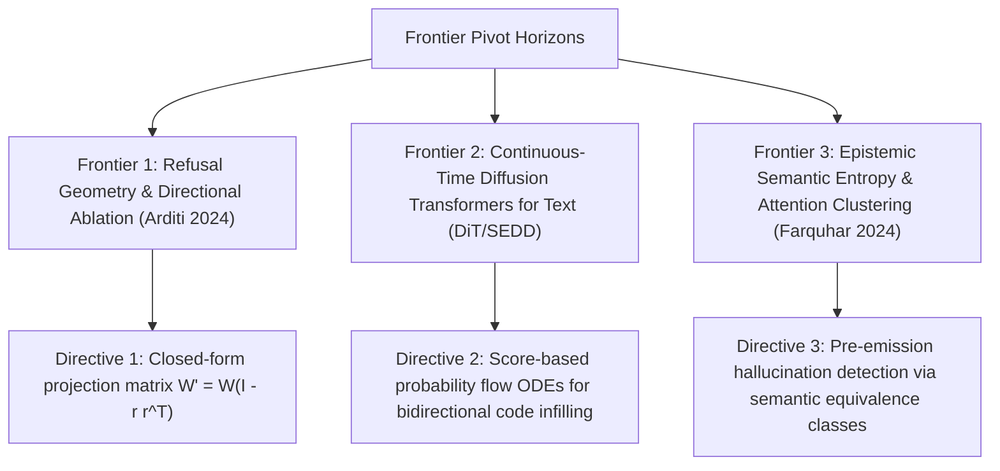

# Frontier Research Pivot: Tri-Pillar Theoretical Horizons

**Autonomous Directive Checkpoint (Iteration 1)**: Systematic analysis of three emerging mathematical and mechanistic frontiers in large language model steerability, alignment, and sequence generation.

---

## Frontier 1: Refusal Geometry & Directional Activation Ablation
- **Theoretical Grounding**: Arditi et al. (2024) demonstrated that model refusal is mediated by a single dominant linear direction $\hat{r} \in \mathbb{R}^{d_{\text{model}}}$ across late-middle residual layers.
- **Intervention Formulation**:
  $$W_{\text{ablated}} = W \left(I - \hat{r} \hat{r}^\top\right), \quad \|\hat{r}\|_2 = 1$$
  Zeroing out the projection along $\hat{r}$ completely suppresses refusal behavior without retraining, establishing that safety guardrails operate as linear geometric boundaries rather than distributed holistic representations.
- **Actionable Steerability Directive**: Extend single-direction ablation to multi-attribute subspace projections for surgical control over sycophancy, bias, and output tone.

---

## Frontier 2: Continuous-Time Diffusion Transformers for Text
- **Theoretical Grounding**: Non-autoregressive generation via score-based probability flow ODEs and continuous-time Markov jump processes (SEDD, Plaid, MDLM).
- **Core Mechanics**: Eliminates causal attention triangles ($O(T^2)$ autoregressive KV-cache dependency) by executing global bidirectional score matching over sequence length $L$.
- **Actionable Steerability Directive**: Formulate non-causal grammar constraints that guide diffusion reverse trajectories via time-dependent gradient projections.

---

## Frontier 3: Epistemic Uncertainty via Semantic Entropy Clustering
- **Theoretical Grounding**: Kuhn et al. (Nature 2023) and Farquhar et al. (Nature 2024). Standard token-level entropy conflates linguistic paraphrasing with factual ignorance.
- **Formulation**:
  $$\mathcal{SE}(x) = -\sum_{c \in \mathcal{C}} P(c \mid x) \log P(c \mid x), \quad c = \text{EntailmentEquivalenceClass}(y_1, \dots, y_N)$$
- **Actionable Steerability Directive**: Deploy semantic entropy monitors during multi-turn agent deliberations to trigger adaptive retrieval (CRAG/Self-RAG) whenever semantic entropy exceeds epistemic risk thresholds.

---

## Cross-Linking
- [[model_abliteration_refusal_geometry]]
- [[contrastive_activation_addition_caa]]
- [[sedd_discrete_diffusion_language_models]]
- [[semantic_entropy_hallucination_detection]]
