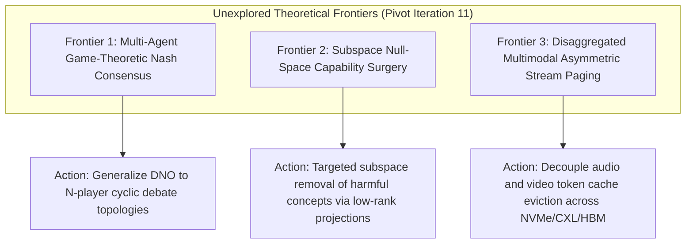

# Frontier Research Pivot Directives (Iteration 11 - September 23, 2026)

## 1. Executive Direction & Pillar Rotation
Following the landmark integration of **Direct Nash Optimization (Section 310)**, **Recursive JSON Schema Compilers (Section 309)**, and **CacheBlend (Section 308)**, this pivot documents three high-impact theoretical frontiers.

---

## 2. Three Unexplored Theoretical Frontiers

### Frontier 1: Multi-Agent Game-Theoretic Nash Consensus
- **Theoretical Gap**: Current multi-agent frameworks (MoA, Magentic-One, LangGraph) use heuristic voting or single-judge aggregators that suffer from intransitive cycling and majority hallucination.
- **Actionable Directive**: Apply Direct Nash Optimization across multi-agent debate topologies, solving for an unexploitable equilibrium distribution over multi-agent consensus proposals.

### Frontier 2: Subspace Null-Space Capability Surgery
- **Theoretical Gap**: Model abliteration can inadvertently damage benign reasoning when the harmful direction is non-orthogonal to core logic circuits.
- **Actionable Directive**: Formulate a bi-level constrained optimization that projects weights into the exact null space of the harmful representation while maximizing the projection onto the principal components of coding and mathematical capability benchmarks.

### Frontier 3: Disaggregated Multimodal Asymmetric Stream Paging
- **Theoretical Gap**: In real-time multimodal assistants (Project Astra, Gemini Live), high-framerate visual tokens consume memory $10\times$ faster than audio tokens, causing unbalanced eviction.
- **Actionable Directive**: Architect an asymmetric tiered paging engine that retains low-bitrate audio tokens in fast SRAM/HBM while offloading high-resolution visual feature frames to CXL/NVMe storage with dynamic SLAM-based re-fetch hooks.
