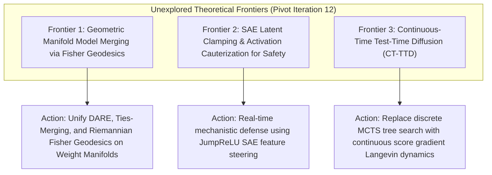

# Frontier Research Pivot Directives (Iteration 12 - September 23, 2026)

## 1. Executive Direction & Pillar Rotation
Following the landmark integration of **Sequoia Tree Speculation (Section 313)**, **GRPO Critic-Free RL (Section 314)**, **Transcoders MLP Linearization (Section 315)**, and **Mooncake Disaggregated KV Pools (Section 316)**, this pivot documents three high-impact theoretical frontiers.

---

## 2. Three Unexplored Theoretical Frontiers

### Frontier 1: Geometric Manifold Model Merging via Riemannian Fisher Geodesics
- **Theoretical Gap**: Current weight merging methods (Slerp, DARE, Ties-Merging) assume Euclidean parameter spaces or heuristic sparsification, causing catastrophic interference and performance degradation across distinct capability domains (e.g., merging math reasoning with coding and creative writing).
- **Actionable Directive**: Formulate model merging along the Riemannian manifold endowed with the empirical Fisher Information Metric:
  $$d_{\mathcal{M}}^2(\theta_1, \theta_2) = (\theta_1 - \theta_2)^T F(\theta) (\theta_1 - \theta_2)$$
  Compute true geodesic paths between expert weights to eliminate destructive interference in shared parameter subspaces.

### Frontier 2: SAE Latent Clamping & Activation Cauterization for Real-Time Safety
- **Theoretical Gap**: Post-training safety guardrails (Llama Guard, NeMo) add round-trip latency, while prompt-level system instructions remain vulnerable to Many-Shot and Token Smuggling attacks.
- **Actionable Directive**: Deploy fast JumpReLU Sparse Autoencoders directly into intermediate residual streams to monitor monosemantic risk latents in real time. If a harmful latent activation $f_{\text{harm}}(x) > \tau$, execute hard latent clamping or activation cauterization in-situ:
  $$\tilde{x} = x - f_{\text{harm}}(x) \mathbf{w}_{\text{dec}, \text{harm}}$$
  rendering adversarial prompts mechanistically inert with zero external LLM evaluation overhead.

### Frontier 3: Continuous-Time Test-Time Diffusion (CT-TTD) in Latent Space
- **Theoretical Gap**: Test-time compute scaling (MCTS, PRM beam search, Best-of-N) operates over discrete token spaces, suffering from exponential combinatorial branching and token-level discretization errors.
- **Actionable Directive**: Model test-time thought generation as a continuous-time reverse Markov jump process or stochastic differential equation (SDE) within the latent representation space. Guide the reverse drift vector with continuous process reward gradients $\nabla_z \mathcal{R}(z)$, allowing the model to smoothly converge to mathematically optimal solutions before token emission.
