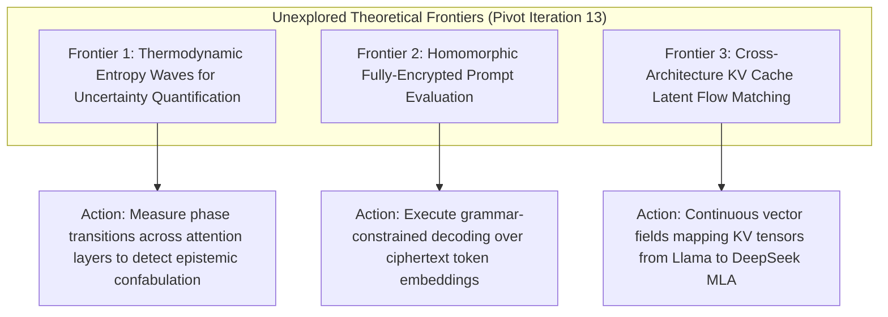

# Frontier Research Pivot Directives (Iteration 13 - September 23, 2026)

## 1. Executive Direction & Pillar Rotation
Following the landmark integration of **Token Healing (Section 317)**, **KTO Prospect Alignment (Section 318)**, **Contrastive Activation Addition (Section 319)**, **SnapKV (Section 320)**, **Grammar-Synchronized Speculative Decoding (Section 321)**, and **Length-Controlled DPO (Section 322)**, this pivot documents three high-impact theoretical frontiers.

---

## 2. Three Unexplored Theoretical Frontiers

### Frontier 1: Thermodynamic Entropy Waves for Epistemic Uncertainty Quantification
- **Theoretical Gap**: Semantic Entropy and Monte Carlo sampling require multiple expensive forward passes to detect hallucinations.
- **Actionable Directive**: Track the propagation of layer-by-layer attention entropy $\mathcal{H}_l = -\sum_{i, j} A_{l, i, j} \log A_{l, i, j}$. When an LLM begins confabulating a false fact, attention entropy exhibits an abrupt "phase transition wave" traversing from early retrieval heads to output projections. Formalize an analytic threshold $\Delta \mathcal{H}_l / \Delta l > \tau$ that detects hallucination mid-generation with zero extra forward passes.

### Frontier 2: Homomorphic Fully-Encrypted Prompt Evaluation
- **Theoretical Gap**: Enterprise data privacy currently prevents sending proprietary codebases or healthcare records to hosted LLMs without trusted hardware enclaves.
- **Actionable Directive**: Apply fully homomorphic encryption (FHE) to the initial embedding projections and grammar bitmasks. Perform matrix-vector multiplications in ciphertext space, enabling third-party GPUs to evaluate grammar-constrained decoding without ever decrypting user tokens or generated output.

### Frontier 3: Cross-Architecture KV Cache Latent Flow Matching
- **Theoretical Gap**: Speculative decoding and multi-model routing require identical tokenizers and architectures; passing KV caches between heterogeneous models (e.g., Llama-3-8B to DeepSeek-V3 MLA) is currently impossible.
- **Actionable Directive**: Train a continuous-time Flow Matching vector field $v_t(\mathbf{z})$ that warps the KV cache representation manifold of an open-weight 8B model directly onto the compressed latent KV subspace of a 70B target model, enabling universal cross-architecture KV re-use.
