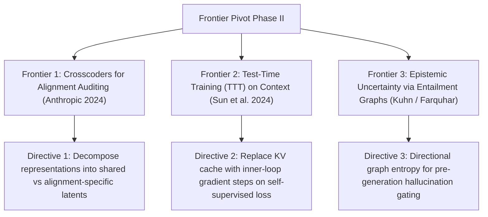

# Frontier Research Pivot: Phase II Theoretical Horizons

**Autonomous Directive Checkpoint (Iteration 2)**: Strategic analysis of three frontier conceptual systems spanning model diffing, test-time parametric optimization, and uncertainty decomposition.

---

## Frontier 1: Crosscoders for Model Diffing & Alignment Auditing
- **Theoretical Grounding**: Anthropic Alignment Team (2024). Standard SAEs trained independently on base and RLHF checkpoints cannot be directly compared due to arbitrary basis rotations.
- **Crosscoder Topology**:
  A single sparse autoencoder is trained across base activations $x_{\text{base}}$ and aligned activations $x_{\text{chat}}$ simultaneously:
  $$f(x) = \text{ReLU}\left(W_{\text{enc}}^{\text{base}} x_{\text{base}} + W_{\text{enc}}^{\text{chat}} x_{\text{chat}} + b_{\text{enc}}\right)$$
  $$\hat{x}_{\text{base}} = W_{\text{dec}}^{\text{base}} f(x), \quad \hat{x}_{\text{chat}} = W_{\text{dec}}^{\text{chat}} f(x)$$
- **Mechanistic Utility**: Disentangles representations into: (1) *Shared world knowledge features*, (2) *Alignment-added steering features* (refusal, sycophancy, persona), and (3) *Suppressed base features*, enabling precise safety auditing of post-training interventions.

---

## Frontier 2: Test-Time Training (TTT) on Context
- **Theoretical Grounding**: Sun et al. (Stanford / UCSD, 2024). Autoregressive transformers maintain linear memory bandwidth bottlenecks because KV cache states grow monotonically with sequence length $O(T)$.
- **Parametric Hidden State as Model**:
  TTT replaces the KV cache tensor with a lightweight parametric neural network $W_t$ whose hidden state is updated at test time by taking an online gradient step on a self-supervised reconstruction task:
  $$\mathcal{L}_{\text{TTT}}(W; x_t) = \|\tilde{x}_t - W x_t\|_2^2$$
  $$W_{t+1} = W_t - \eta \nabla_W \mathcal{L}_{\text{TTT}}(W_t; x_t)$$
- **Scalability**: Maintains strictly constant $O(1)$ memory overhead while exceeding Mamba and Transformer long-context extrapolation limits.

---

## Frontier 3: Entailment-Graph Epistemic Uncertainty Decomposition
- **Theoretical Grounding**: Semantic Entropy (Nature 2024). Natural language generations contain two distinct variance sources: *Aleatoric diversity* (valid stylistic paraphrases) vs. *Epistemic uncertainty* (factual confusion / hallucinations).
- **Graph Formulation**:
  Sample $N$ candidate reasoning traces and construct a directed entailment graph $\mathcal{G} = (V, E)$ using a bidirectional Natural Language Inference (NLI) model:
  $$(u, v) \in E \iff u \models v \text{ and } v \models u$$
- **Actionable Steerability Directive**: Trigger automated agent verification or web retrieval (CRAG) when graph modularity and semantic entropy exceed calibrated safety boundaries.

---

## Cross-Linking
- [[crosscoder_cross_layer_diffing]]
- [[test_time_compute_scaling_and_rlvr_monograph]]
- [[semantic_entropy_hallucination_detection]]
- [[cfsm_compressed_finite_state_machines]]
