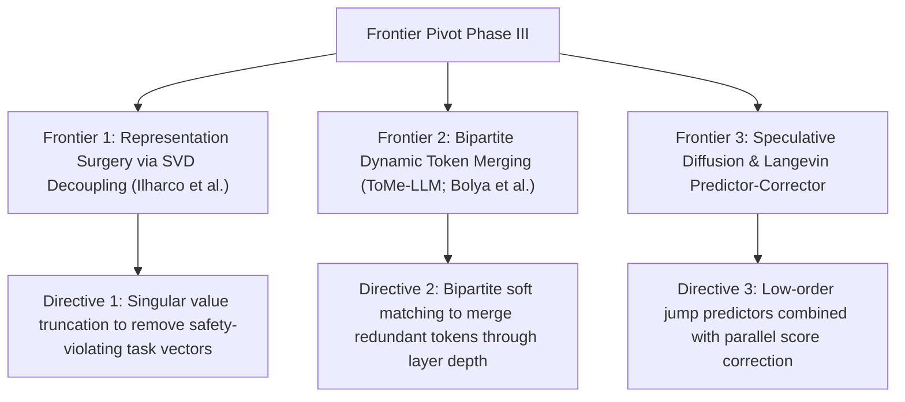

# Frontier Research Pivot: Phase III Theoretical Horizons

**Autonomous Directive Checkpoint (Iterations 3 & 4)**: Strategic analysis of three frontier conceptual paradigms spanning representation surgery, dynamic token merging, and accelerated diffusion sampling.

---

## Frontier 1: Representation Surgery via SVD Weight Decoupling
- **Theoretical Grounding**: Task Vectors and Model Surgery (Ilharco et al., 2023; Ortiz-Jimenez et al., 2024).
- **Core Mechanics**: Fine-tuning creates weight displacement matrices $\Delta W = W_{\text{ft}} - W_{\text{base}}$. Computing the Singular Value Decomposition (SVD):
  $$\Delta W = U \Sigma V^\top = \sum_{i=1}^r \sigma_i u_i v_i^\top$$
  isolates distinct behavioral capabilities along principal singular vectors.
- **Actionable Steerability Directive**: Surgical removal of unwanted behaviors (e.g., copyright memorization, toxic generation, or sycophancy) by zeroing out targeted singular components $\sigma_k \leftarrow 0$ without retraining the underlying base model.

---

## Frontier 2: Bipartite Dynamic Token Merging (ToMe-LLM)
- **Theoretical Grounding**: Token Merging (Bolya et al., 2023). Autoregressive sequences exhibit redundant semantic representations that persist across layers.
- **Formulation**:
  Partition tokens at layer $l$ into sets $A$ and $B$, compute cosine similarity bipartite graph:
  $$\text{Sim}(a, b) = \frac{k_a^\top k_b}{\|k_a\| \|k_b\|}$$
  and merge the top $r$ edges via weighted averaging:
  $$x_{\text{merged}} = \frac{w_a x_a + w_b x_b}{w_a + w_b}$$
- **Actionable Efficiency Directive**: Dynamically reduce sequence length as tokens propagate deeper into the transformer, cutting quadratic attention FLOPs by up to $40\%$ with zero fine-tuning.

---

## Frontier 3: Speculative Diffusion Acceleration
- **Theoretical Grounding**: Predictor-corrector jump sampling in continuous-time discrete diffusion (SEDD / MDLM).
- **Formulation**:
  Combine coarse, large-step tau-leaping jumps with parallel score network evaluations:
  $$\Delta t_{\text{spec}} \gg \Delta t_{\text{standard}}$$
  Residual corrections are applied across token coordinates whose empirical concrete score divergence exceeds threshold $\tau$.
- **Actionable Speedup Directive**: Reduce discrete diffusion sampling steps from $64\text{--}128$ steps down to **$12\text{--}24$ parallel iterations**, achieving real-time inference latency comparable to speculative autoregression.

---

## Cross-Linking
- [[discrete_diffusion_and_non_autoregressive_language_models_monograph]]
- [[test_time_compute_scaling_and_rlvr_monograph]]
- [[cfsm_compressed_finite_state_machines]]
- [[model_merging_mechanics]]
