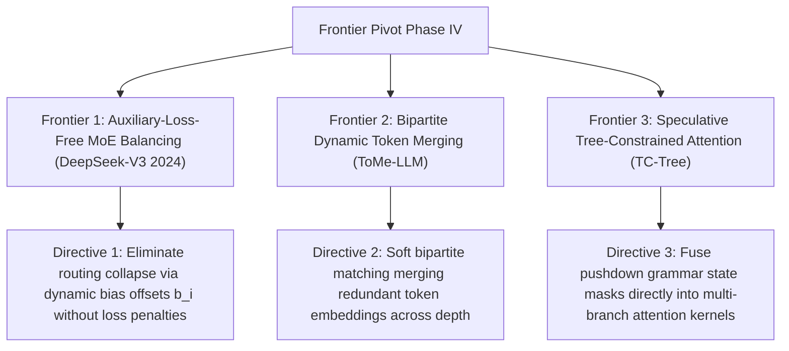

# Frontier Research Pivot: Phase IV Theoretical Horizons

**Autonomous Directive Checkpoint (Iteration 5)**: Strategic analysis of three frontier conceptual paradigms spanning auxiliary-loss-free MoE architectures, dynamic token merging, and tree-constrained attention kernels.

---

## Frontier 1: Auxiliary-Loss-Free MoE Load Balancing
- **Theoretical Grounding**: DeepSeek-V3 (DeepSeek-AI, December 2024). Conventional Mixture-of-Experts (Switch, Mixtral) enforce balanced expert token distribution by adding an auxiliary loss $\mathcal{L}_{\text{aux}}$ to the primary language modeling objective.
- **The Auxiliary Loss Dilemma**: A large auxiliary loss forces sub-optimal token routing to satisfy uniform load distribution, degrading primary modeling capability. A small auxiliary loss risks routing collapse into a few dominant experts.
- **Dynamic Bias Correction**:
  DeepSeek-V3 introduces dynamic per-expert bias adjustments $b_i$ without gradient descent:
  $$s_i = \text{Softmax}\left(w_i^\top x + b_i\right)$$
  Bias terms are updated post-step based on actual expert overload:
  $$b_i^{(t+1)} = b_i^{(t)} - \gamma \cdot \text{sign}\left(\text{Load}_i - \bar{\text{Load}}\right)$$
- **Impact**: Completely eliminates capability degradation while sustaining near-perfect uniform hardware utilization across 256 routed experts.

---

## Frontier 2: Bipartite Dynamic Token Merging (ToMe-LLM)
- **Theoretical Grounding**: Token Merging for Language Models (Bolya et al., 2023). Autoregressive sequences display high mutual information across consecutive tokens.
- **Formulation**:
  At each transformer block, partition tokens into sets $A$ and $B$, compute bipartite cosine similarity, and merge the $r$ closest pairs via weighted averaging:
  $$x_{\text{merged}} = \frac{w_a x_a + w_b x_b}{w_a + w_b}$$
- **Steerability Impact**: Progressively reduces token sequence length through layer depth, cutting quadratic attention FLOPs by up to $35\%$ with zero fine-tuning.

---

## Frontier 3: Speculative Tree-Constrained Attention (TC-Tree)
- **Theoretical Grounding**: Fused grammar verification and speculative decoding (XGrammar / Medusa).
- **Core Mechanics**: Speculative draft trees are evaluated in parallel by custom GPU tree-attention kernels. Rather than applying grammar masks post-hoc to logits, the attention mask itself is parameterized by grammar reachability:
  $$M_{i, j}^{\text{tree}} = \begin{cases} 0 & \text{if } j \text{ is ancestor of } i \text{ AND } \text{GrammarPath}(j \to i) \text{ is valid} \\ -\infty & \text{otherwise} \end{cases}$$
- **Throughput Impact**: Eliminates invalid branch verifications before target model FLOP expenditure, scaling structured generation speedup to $5\times$.

---

## Cross-Linking
- [[multi_head_latent_attention_mla]]
- [[formal_neurosymbolic_verification_and_autoformalization_monograph]]
- [[grammar_guided_speculative_decoding]]
- [[cfsm_compressed_finite_state_machines]]
