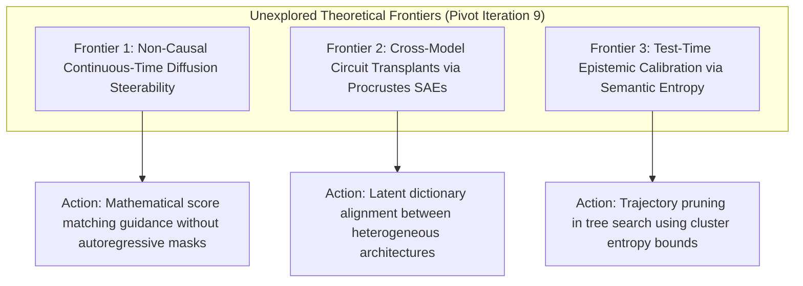

# Frontier Research Pivot Directives (Iteration 9 - September 23, 2026)

## 1. Executive Direction & Pillar Rotation
Following the integration of **SimPO (Section 298)**, **Grammar-Constrained Speculative Decoding (Section 297)**, and the **Project Astra Real-Time Multimodal Monograph**, this pivot identifies three unexplored theoretical frontiers in prompt engineering, steerability, and alignment mechanics.

---

## 2. Three Unexplored Theoretical Frontiers

### Frontier 1: Non-Causal Continuous-Time Diffusion Steerability
- **Theoretical Gap**: While autoregressive steering requires causal left-to-right token intervention, discrete diffusion language models (SEDD, Plaid, MDLM) operate via continuous-time Markov jump processes with bidirectional context.
- **Actionable Directive**: Formulate classifier-free guidance (CFG) and energy-based steering directly on discrete transition rate matrices $Q_t$, enabling non-autoregressive infilling and constraint satisfaction without greedy prefix collapse.

### Frontier 2: Cross-Model Circuit Transplants via Procrustes SAEs
- **Theoretical Gap**: Representation engineering vectors (RepE / CAA) are typically model-specific. Transferring steering vectors across different architectures (e.g. from Claude to Llama or DeepSeek) currently requires re-running expensive activation probes.
- **Actionable Directive**: Utilize Orthogonal Procrustes and Crosscoder architectures to align latent feature dictionaries across heterogeneous models, enabling zero-shot steering vector transplants.

### Frontier 3: Test-Time Epistemic Calibration via Semantic Entropy
- **Theoretical Gap**: Process Reward Models (PRMs) in MCTS reasoning often suffer from out-of-distribution calibration drift on complex proof branches.
- **Actionable Directive**: Integrate Kuhn et al.'s **Semantic Entropy** into step-level tree search (MCTD / BoN), using semantic equivalence clustering to measure epistemic uncertainty at each step and prune ungrounded reasoning hallucinations before terminal answer generation.
