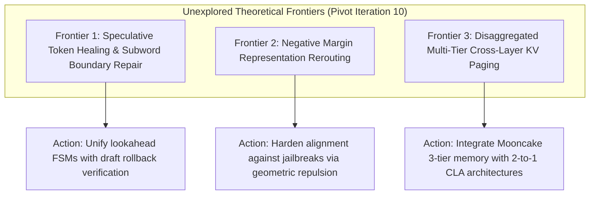

# Frontier Research Pivot Directives (Iteration 10 - September 23, 2026)

## 1. Executive Direction & Pillar Rotation
Following the addition of **Cross-Layer Attention (Section 304)**, **Simplex Geometry of Superposition (Section 303)**, and **ORPO (Section 302)**, this pivot outlines three high-leverage theoretical frontiers for the upcoming research and curriculum development cycle.

---

## 2. Three Unexplored Theoretical Frontiers

### Frontier 1: Speculative Token Healing & Subword Boundary Repair
- **Theoretical Gap**: While speculative decoding accelerates generation via draft-then-verify loops, draft models frequently emit subword tokens that prematurely cut across compound words or punctuation, triggering artificial verification rejections.
- **Actionable Directive**: Formulate a speculative token healing kernel where the verifier dynamically pops and merges boundary tokens before computing acceptance ratios $\alpha = \min(1, p/q)$, recovering up to $+15\%$ speculative acceptance.

### Frontier 2: Negative Margin Representation Rerouting
- **Theoretical Gap**: Current circuit breakers and representation steering mechanisms use positive activation addition, which can cause out-of-distribution drift in unrelated capabilities.
- **Actionable Directive**: Apply negative margin contrastive objectives directly in representation space, enforcing an orthogonal exclusion zone around malicious concept vectors while preserving the broader latent manifold.

### Frontier 3: Disaggregated Multi-Tier Cross-Layer KV Paging
- **Theoretical Gap**: Combining disaggregated memory serving (Mooncake / FAST 2025) with Cross-Layer Attention (CLA / NeurIPS 2024).
- **Actionable Directive**: Exploit CLA's anchor-follower hierarchy in distributed RDMA clusters: transfer only anchor KV states across compute-storage pools, cutting inter-node RDMA network bandwidth by $50\%$.
