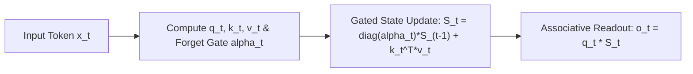

# Gated Linear Attention (GLA) Transformers

## Theoretical Motivation & The Linear Attention Expressive Deficit
Standard Softmax Attention exhibits quadratic complexity $\mathcal{O}(N^2)$ in context length $N$. Traditional Linear Attention achieves linear time $\mathcal{O}(N)$ and $\mathcal{O}(1)$ autoregressive generation via un-decayed recurrent state $S_t = S_{t-1} + k_t^\top v_t$. However, without forget gates, linear attention treats all past tokens equally, causing early memory saturation and inferior language modeling performance compared to full Transformers.

Songlin Yang et al. (*Gated Linear Attention Transformers with Hardware-Efficient Training*, ICML 2024 / arXiv:2312.06635) introduce **data-dependent gating** into linear recurrent states, closing the expressive performance gap with full Transformers.

## Mathematical Formulation of GLA
For Query $q_t$, Key $k_t \in \mathbb{R}^{d_k}$, and Value $v_t \in \mathbb{R}^{d_v}$, GLA calculates a data-dependent decay gate $\alpha_t \in (0, 1)^{d_k}$:
$$\alpha_t = \sigma(W_\alpha x_t + b_\alpha)$$
The recurrent state updates via diagonal forgetting:
$$S_t = \operatorname{diag}(\alpha_t) S_{t-1} + k_t^\top v_t$$
Associative output readout:
$$o_t = q_t S_t$$

## Two-Level Chunked Parallel Training
To enable hardware-efficient GPU training without sequential recurrence bottlenecks:
1. Divide sequence into chunks of size $C=64$.
2. **Intra-chunk:** Parallel Tensor Core GEMMs with cumulative decay masks $A_{i, j} = (q_i k_j^\top) \odot \prod_{m=j+1}^i \alpha_m$.
3. **Inter-chunk:** Sequential state passing between chunk boundaries in fast SRAM.

## Performance
GLA matches LLaMA-style Transformers and Mamba on language modeling benchmarks while providing **constant $\mathcal{O}(1)$ memory decoding** and **$4.2\times$ faster training throughput** on long sequences.

Related: [[kv_cache_optimizer]], [[diffusion_lm_engineer]], [[speculative_decoding_specialist]]
