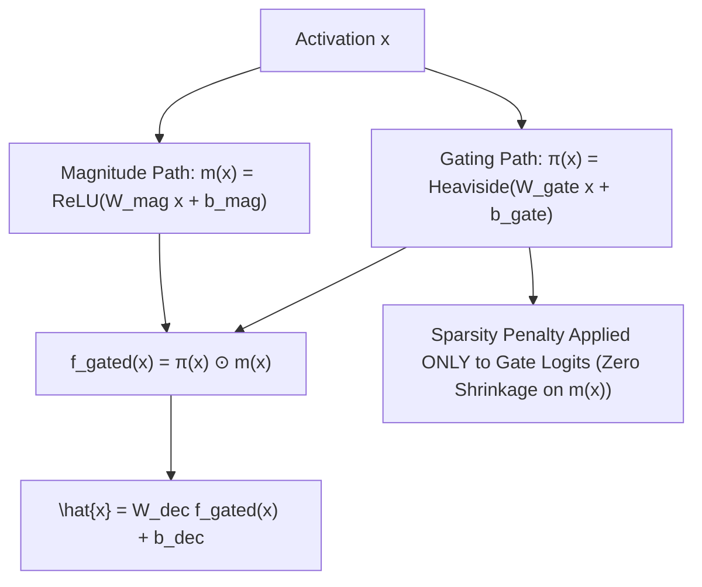

# Gated Sparse Autoencoders: Eliminating L1 Shrinkage

**Gated Sparse Autoencoders (Gated SAEs)** (Rajamanoharan et al., Google DeepMind, 2024) resolve the fundamental mathematical defect of standard $L_1$-penalized dictionary learning—**feature shrinkage**—by decoupling the discrete detection of feature presence from the continuous estimation of feature magnitude.

## Mathematical Mechanics
1. **The L1 Shrinkage Defect:**
   In standard SAEs, penalizing activations via $\lambda \|f(x)\|_1$ applies a constant negative gradient $\frac{\partial \mathcal{L}}{\partial f_i} = \lambda > 0$, systematically compressing feature activations below their true physical magnitudes.
2. **Dual-Branch Decoupling:**
   $$\pi(x) = \mathbb{I}\left(W_{\text{gate}} x + b_{\text{gate}} > 0\right), \quad m(x) = \text{ReLU}\left(W_{\text{mag}} x + b_{\text{mag}}\right)$$
   $$f_{\text{gated}}(x) = \pi(x) \odot m(x)$$
   Because the magnitude weights receive zero gradient from the sparsity loss:
   $$\frac{\partial \mathcal{L}_{\text{sparsity}}}{\partial m_i(x)} \equiv 0$$
   feature shrinkage is mathematically eliminated.
3. **Pareto Dominance:**
   At identical $L_0$ sparsity ($k \approx 30\text{--}60$), Gated SAEs achieve $20\%\text{--}40\%$ lower reconstruction MSE across Gemma and LLaMA-3 models, recovering purer monosemantic features and eliminating dead latents.

## Related Mechanics
- [[sparse_autoencoders_dictionary_learning]]
- [[jump_relu_sparse_autoencoders]]
- [[transcoder_networks_mlp_circuit_tracing]]
- [[scaling_monosemanticity_claude3_sae]]
