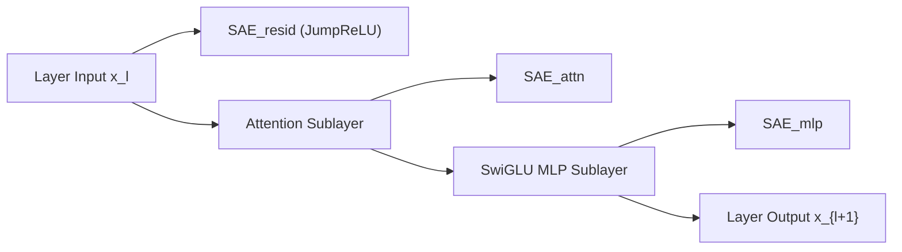

# Gemma Scope: Multi-Layer JumpReLU Sparse Autoencoders

## 1. Comprehensive Whole-Model Interpretability
Prior SAE investigations analyzed isolated layers, leaving circuit cascades obscure. **Gemma Scope** (Lieberum et al., Google DeepMind, August 2024) provides open-weight SAE suites totaling $>30\text{ million}$ monosemantic latents across **every single layer and sublayer** of Gemma 2 (2B and 9B): residual streams, attention outputs, and MLP intermediate states.

## 2. JumpReLU Activation: Eradicating Shrinkage Bias
Standard $L_1$ penalties shrink active feature magnitudes ($\hat{f} = \max(0, z - \lambda)$), degrading downstream loss. Gemma Scope standardizes on **JumpReLU SAEs**:
$$\text{JumpReLU}_{\boldsymbol{\theta}}(z_i) = z_i \cdot \mathcal{H}(z_i - \theta_i) = \begin{cases} z_i & \text{if } z_i > \theta_i \\ 0 & \text{if } z_i \le \theta_i \end{cases}$$
Optimized via straight-through estimators against exact $L_0$ target sparsity:
$$\mathcal{L} = \| x - \hat{x} \|_2^2 + \lambda \sum_{i=1}^M \mathcal{H}(z_i - \theta_i)$$

- **High-Fidelity Reconstruction:** Recovers **$>94\%$ of base model cross-entropy loss** with narrow sparsity ($L_0 \in [40, 80]$ out of 131k features).
- **Universal Platonic Convergence:** Cross-layer features track conceptual trajectories from raw syntax in early layers to abstract jurisprudence and factual reasoning in late layers, matching representations found in Claude 3 and Llama 3.
