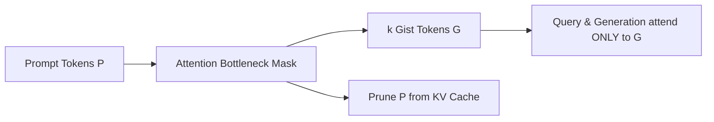

# Gist Tokens & Attention Bottlenecked Prompt Compression

## Theoretical Formulation & Attention Bottlenecking
**Gist Tokens** (Mu et al., NeurIPS 2023 / arXiv:2304.08467) compress long prompt instructions $P = (x_1, \dots, x_L)$ into $k$ special learnable bottleneck tokens $\mathcal{G} = [g_1, \dots, g_k]$ inserted at prompt boundaries. 

Standard causal Transformers force every generation token to attend across all prompt tokens. Gist tokens break this dependence by modifying the causal attention mask $M \in \{0, 1\}^{N \times N}$:
1. Prompt tokens $P$ attend causally to themselves: $M_{i, j} = 1$ for $j \le i \in P$.
2. Gist tokens $\mathcal{G}$ attend to both $P$ and preceding gist tokens: $M_{g, i} = 1$ for all $i \in P \cup \{g' \le g\}$.
3. Subsequent query $I$ and completion tokens $Y$ are explicitly forbidden from attending to raw prompt tokens: $M_{t, i} = 0$ for $t \in I \cup Y$ and $i \in P$.
4. Instead, $I$ and $Y$ attend directly to the gist tokens: $M_{t, g} = 1$ for $g \in \mathcal{G}$.

## KV Cache Pruning Mechanics
During prefill, $P$ and $\mathcal{G}$ are processed once to materialize Key-Value activations. Because generation tokens never attend to $P$, all KV states corresponding to $P$ are immediately pruned from GPU VRAM. Only the $k \times d_{\text{kv}}$ tensors of the gist tokens are retained in memory.

## Empirical Impact
On LLaMA-7B across HumanEval and Alpaca, Gist conditioning delivers:
- **Up to $26\times$ prompt token compression**.
- **$40\%$ reduction in prefill FLOPs**.
- Accelerated time-to-first-token (TTFT) and reduced decoding VRAM consumption with minimal accuracy loss.

Related: [[context_compression_engineer]], [[kv_cache_optimizer]], [[longllmlingua_question_compression]]
