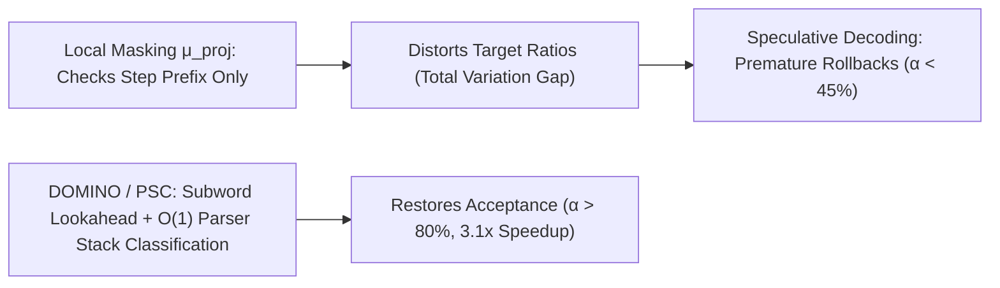

# Grammar-Constrained Speculative Decoding & The Future Validity Dilemma

## 1. Local Projection vs True Conditioning
When enforcing formal grammars $\mathcal{G}$ (JSON, SQL, Regex) on LLMs, production decoders apply **local logit masking**:
$$\mu_{\text{proj}}(x_t \mid x_{<t}) \propto p(x_t \mid x_{<t}) \cdot \mathbb{I}(x_{<t} \circ x_t \in \text{Prefix}(\mathcal{L}(\mathcal{G})))$$
However, $\mu_{\text{proj}}$ is mathematically distinct from the true posterior $\mu^\star(x) = p(x \mid x \in \mathcal{L}(\mathcal{G}))$. Local projection ignores the **Future Validity Probability** $\Phi_t(x_{\le t}) = P(x \in \mathcal{L}(\mathcal{G}) \mid x_{\le t})$, trapping the model in low-probability syntactic dead ends.

## 2. Speculative Cascades & DOMINO / PSC Solutions
Under speculative verification (Leviathan rejection sampling), distortion in $\frac{\mu_{p, \text{proj}}}{\mu_{q, \text{proj}}}$ causes acceptance rates to drop from $>80\%$ to $<45\%$.
- **DOMINO (ICML 2024)**: Solves subword prefix boundary violations and verifies lookahead continuation soundness, eliminating dead-end prefix traps.
- **Parser Stack Classification (PSC)**: Hashes the Pushdown Automaton (PDA) stack into precomputed bitsets, enabling **$O(1)$ grammar masking** ($<0.08\,\text{ms}$) on GPU tensor cores and raising speculative speedup to **$3.15\times$**.
