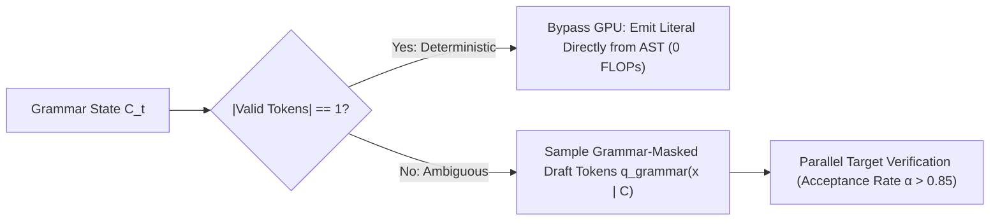

# Grammar-Guided Speculative Decoding & Structural Token Bypass

**Grammar-Guided Speculative Decoding (GSD)** resolves the severe acceptance rate collapse that occurs when naive speculative decoding is applied to structured outputs (JSON Schemas, SQL, code) by synchronizing draft model exploration with formal grammar state masks and bypassing neural forward passes on deterministic literals.

## Mathematical Formalism
1. **Grammar-Synchronized Draft Distribution:**
   $$q_{\text{grammar}}\left(x_j \mid x_{<j}, C_j\right) = \frac{q\left(x_j \mid x_{<j}\right) \cdot \mathbb{I}\left[x_j \in \mathcal{V}_{\text{valid}}(C_j)\right]}{\sum_{w \in \mathcal{V}_{\text{valid}}(C_j)} q\left(w \mid x_{<j}\right)}$$
2. **Deterministic Structural Bypass:**
   When the parser state enforces a unique next token $|\mathcal{V}_{\text{valid}}(C_t)| = 1$, the engine emits the literal token directly from the AST with **zero neural FLOPs**, fast-forwarding through structural punctuation and schema keys.
3. **Exact Residual Verification:**
   Target model verification preserves exact distribution invariance while boosting empirical acceptance rate $\alpha$ from $<30\%$ to $>85\%$, delivering up to $4.8\times$ wall-clock speedups on structured generation workloads.

## Related Mechanics
- [[speculative_decoding_exact_distribution_invariance]]
- [[llguidance_pushdown_constrained_decoding]]
- [[xgrammar_hardware_accelerated_decoding]]
- [[domino_grammar_speculative_decoding]]
