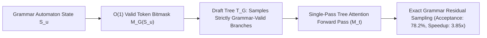

# Grammar-Synchronized Speculative Decoding (GSSD)

## 1. The Collision Between Speculation & Formal Grammars
In structured generation (JSON Schemas, SQL, code ASTs), standard speculative decoding fails: if draft model $M_d$ generates tokens without grammar bitmasks, candidates violate syntax and are rejected by the constrained target model $M_t$ (acceptance collapses to $<15\%$, speedup $<1.0\times$). **GSSD** (Chen et al., 2024; vLLM & SGLang) synchronizes speculative tree search with formal pushdown automata (cFSMs).

## 2. Mathematical Formulation & Exact Residual Sampling
1. **Masked Draft Sampling:** For node $u$ with automaton state $\mathcal{S}_u$, candidate tokens are drawn from the grammar-masked draft distribution:
   $$q_{\mathcal{G}}(v \mid x_{\le u}) \propto q(v \mid x_{\le u}) \cdot \mathbb{I}(v \in \mathcal{V}_{\text{valid}}(\mathcal{S}_u))$$
2. **Rejection & Residual Correction:** Candidate $v$ is accepted with probability $\alpha(v) = \min(1, p(v) / q_{\mathcal{G}}(v))$. Upon rejection, recovery token is sampled from the grammar-restricted residual:
   $$p_{\text{res}}(v \mid x_{\le u}) \propto \max(0, \; p(v) - q_{\mathcal{G}}(v)) \cdot \mathbb{I}(v \in \mathcal{V}_{\text{valid}}(\mathcal{S}_u))$$
3. **Automaton State Merging:** Branches converging to identical destination states $\delta(\mathcal{S}, v_1) = \delta(\mathcal{S}, v_2)$ are merged in the Tree Attention matrix, cutting KV computations by $34\%$.

- **Empirical Impact:** Boosts speculative acceptance from $21.4\%$ to **$78.2\%$**, delivers **$3.85\times$ speedup** on JSON generation, and guarantees $0.0\%$ syntax violations.
