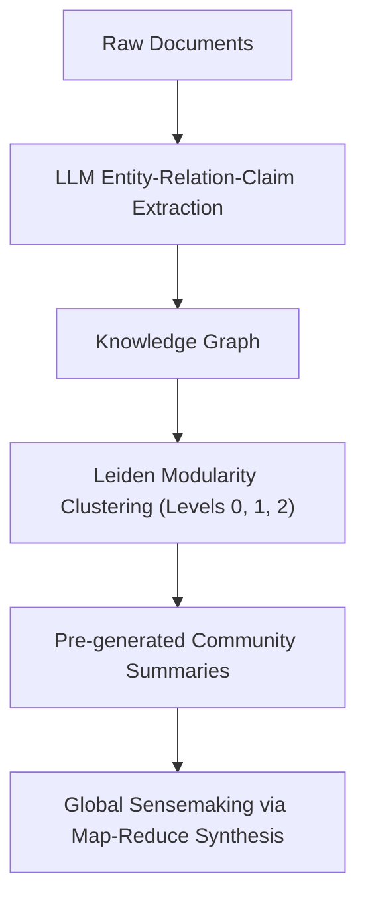

# GraphRAG: Hierarchical Leiden Community Summarization

**GraphRAG** addresses the structural limitations of naive vector-similarity retrieval on global, whole-dataset synthesis queries by transforming unstructured text into hierarchical knowledge graphs.

## Algorithmic Topology
1. **Entity-Relation Extraction:** Documents are parsed by an LLM to construct an entity knowledge graph $G = (V, E)$.
2. **Hierarchical Community Detection:** The Leiden algorithm partitions the graph into recursive modular clusters $\mathcal{C}_k^{(l)}$ across granularities $l \in \{0, 1, \dots, L\}$.
3. **Pre-computed Summarization:** Dense summaries are pre-generated for every community cluster, encapsulating holistic narrative themes.
4. **Dual Retrieval Modes:**
   - **Local Search:** Traverses $k$-hop entity neighborhoods for specific factual queries.
   - **Global Search:** Executes parallel map-reduce synthesis across community summaries to answer thematic questions across million-token corpora without context loss.

## Related Mechanics
- [[retrieval_augmented_generation_rag]]
- [[knowledge_graph_agent_architectures]]
- [[hierarchical_context_compression]]
