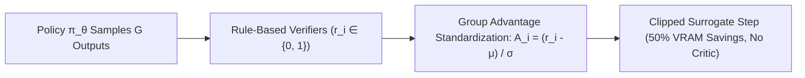

# Group Relative Policy Optimization (GRPO)

## 1. Critic-Free Reinforcement Learning
Classical PPO requires maintaining four separate models in GPU VRAM (Actor $\pi_\theta$, Critic $V_\phi$, Reference $\pi_{\text{ref}}$, Reward $R_\psi$), where the Critic network is identical in size to the Actor and suffers from severe value estimation drift on multi-thousand token reasoning chains. **GRPO** (Shao et al., DeepSeek-AI, 2024) **completely eliminates the Critic network**, deriving baseline advantages directly from relative scoring within a sampled group of $G$ candidate outputs:
$$A_i = \frac{r_i - \text{mean}\left(\{r_1, \dots, r_G\}\right)}{\text{std}\left(\{r_1, \dots, r_G\}\right) + \epsilon}$$

## 2. Clipped Surrogate Objective & Reasoning Emergence
Parameters are optimized via a token-level clipped surrogate objective with analytical KL regularization:
$$\mathcal{L}_{\text{GRPO}}(\theta) = -\frac{1}{G}\sum_{i=1}^G \frac{1}{|o_i|}\sum_{t=1}^{|o_i|} \min\left( \frac{\pi_\theta}{\pi_{\text{old}}} A_i, \; \text{clip}\left(\frac{\pi_\theta}{\pi_{\text{old}}}, 1-\epsilon, 1+\epsilon\right) A_i \right) + \beta \, \mathbb{D}_{\text{KL}}(\pi_\theta \,||\, \pi_{\text{ref}})$$

- **Autonomous Self-Correction (DeepSeek-R1-Zero):** When optimized purely with rule-based verifiable rewards ($r_{\text{acc}} + r_{\text{format}}$) from base models without SFT, GRPO triggers autonomous test-time compute allocation, spontaneous backtracking ("aha moments"), and dynamic chain-of-thought expansion up to $28\text{k}+$ tokens.
- **State-of-the-Art Mathematical Performance:** DeepSeek-R1 attains **$91.2\%$ on MATH 500** and **$79.8\%$ on AIME 2024**, matching OpenAI o1 while cutting memory footprint by $\approx 50\%$.
