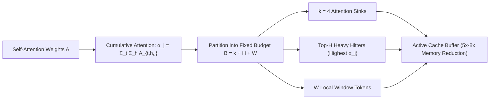

# H2O: Heavy Hitter Oracle for KV Cache Pruning

**H2O (Heavy Hitter Oracle)** (Zhang et al., NeurIPS 2023) proves that self-attention follows a heavy-tailed power-law distribution where approximately $5\%$ of tokens ("heavy hitters", $H_2$) receive over $80\%$ of cumulative attention weight, enabling bounded-size KV cache eviction without performance degradation.

## Mathematical Formalism
1. **Cumulative Attention Metric:**
   $$\alpha_j^{(t)} = \sum_{\tau=j}^t \sum_{h=1}^H A_{\tau, h, j}, \quad A_{\tau, h, j} = \text{Softmax}\left(\frac{q_{\tau, h}^\top k_{j, h}}{\sqrt{d}}\right)$$
2. **Tri-Tier Cache Maintenance:**
   $$\mathcal{M}_t = \mathcal{M}_{\text{sink}} \cup \text{Top-H}\left(\{\alpha_j^{(t)}\}_{j=k+1}^{t-W}, H\right) \cup \{t-W+1, \dots, t\}$$
3. **Systems Impact:** Slashes KV-cache VRAM by $5\times\text{--}8\times$ and accelerates generation throughput by $3\times$ while matching dense baseline perplexity within $0.5\%$.

## Related Mechanics
- [[quest_query_aware_kv_cache_sparsity]]
- [[streamingllm_attention_sinks]]
- [[cross_layer_attention_kv_sharing]]
- [[snapkv_hierarchical_eviction]]
