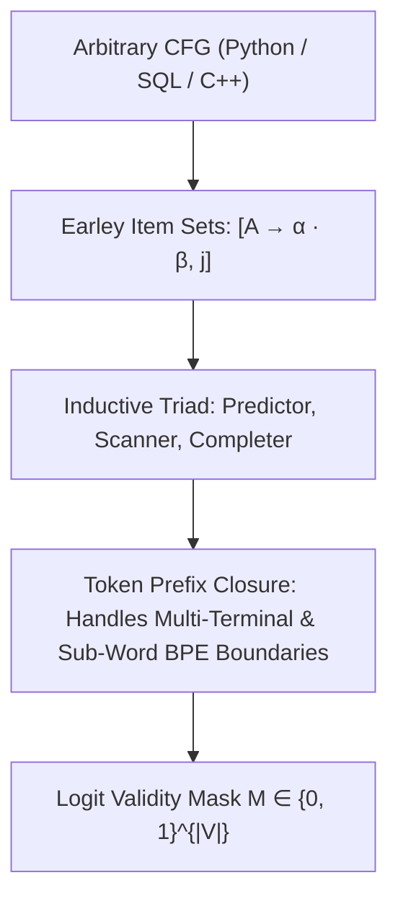

# Incremental Earley Parser Constrained Decoding

**Incremental Earley Parsing** (SynCode / Earley-LLM, 2024) enables constrained decoding under arbitrary, ambiguous Context-Free Grammars (CFGs) without requiring grammars to be refactored into deterministic LR(1) forms, resolving the sub-word tokenizer boundary alignment problem via token prefix closures.

## Mathematical Mechanics
1. **Dotted Production Representation:**
   Tracks parsing progress using Earley items $[A \to \alpha \cdot \beta, j] \in \mathcal{I}_k$, maintaining multiple active derivation paths concurrently to parse ambiguous syntax without backtracking.
2. **Token Prefix Closures:**
   Bypasses the mismatch between sub-word tokens $w \in \mathcal{V}$ and grammar terminals $\tau \in V_T$:
   $$\text{Valid}(w \mid \mathcal{I}_k) \iff \exists \tau_{1 \dots m} \text{ such that } \text{bytes}(w) \subseteq \text{bytes}(\tau_{1 \dots m}) \text{ and } \mathcal{I}_k \xrightarrow{\tau_{1 \dots m}} \mathcal{I}_{k+m}$$
3. **Execution Guarantees:**
   Enforces compile-time syntax correctness ($100\%$ valid ASTs) across complex programming languages without pruning syntactically valid continuations or crashing on ambiguous shift-reduce states.

## Related Mechanics
- [[constrained_decoding_grammar_masks]]
- [[llguidance_pushdown_constrained_decoding]]
- [[cfsm_compressed_finite_state_machines]]
- [[token_healing_boundary_mechanics]]
