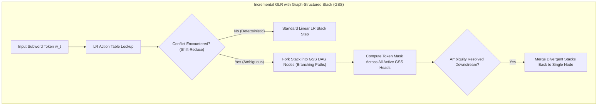

# Incremental GLR Parsing & Graph-Structured Stacks in Constrained Decoding

## 1. The Dilemma of Non-Deterministic Grammars in LLM Steering
In formal language constrained decoding, LLMs must generate code, SQL queries, or nested expressions conforming to context-free grammars (CFGs).
- **Deterministic LR(1) Parsers:** Table-driven LR(1) parsers execute in $O(1)$ time per transition via pre-compiled action tables ($\text{Action}[s, a] \in \{\text{Shift } s', \text{Reduce } A \to \beta, \text{Accept}, \text{Error}\}$). However, real programming grammars (C++, SQL, Python, domain-specific ASTs) frequently contain **shift-reduce or reduce-reduce conflicts**, causing LR(1) table construction to fail.
- **Earley Parsers:** While Earley parsers handle arbitrary ambiguous CFGs, maintaining dynamic Earley state sets across a $128\text{K}$ vocabulary incurs heavy CPU memory allocation and pointer-chasing latency ($>5\,\text{ms}$ per token).

## 2. Mathematical Mechanics of Graph-Structured Stacks (GSS)
**Incremental Generalized LR (GLR)** (Tomita, 1985 / modernized for LLM logit masking) solves this by maintaining a directed acyclic graph (DAG) of parser stacks called a **Graph-Structured Stack (GSS)**:
$$\mathcal{G}_{\text{GSS}} = (\mathcal{V}_{\text{stack}}, \mathcal{E}_{\text{stack}})$$
where each node $v = (s, l) \in \mathcal{V}_{\text{stack}}$ represents a parse state $s \in S$ at tree depth $l$.

1. **Stack Forking on Conflict:**
   If action table lookup yields multiple valid actions:
   $$\text{Action}[s, a] = \{ \text{Shift } s', \; \text{Reduce } A \to \beta \}$$
   the GSS forks into multiple path heads without duplicating the shared stack history.
2. **Vocabulary Token Mask Assembly:**
   A subword token $w \in \Sigma$ is permitted if and only if it is admissible by *at least one* active GSS head:
   $$\mathcal{M}(w) = \bigvee_{v \in \text{Heads}(\mathcal{G}_{\text{GSS}})} \mathbb{I}\left( \text{ValidTransition}(v, w) \right)$$
3. **Local Confluence & Stack Merging:**
   When two divergent parsing branches reduce to the same non-terminal symbol $A$ and reach the same parser state $s_{\text{target}}$, the two stack branches merge back into a single shared node:
   $$v_{\text{merged}} = \text{Merge}(v_1, v_2)$$
   This prevents exponential path explosion, bounding GSS width to $O(1)$ for typical programming languages.

### Performance Profile
- **Deterministic Efficiency:** Runs at pure LR table-lookup speed ($<80\,\text{ns}$) for unambiguous grammar segments ($>95\%$ of tokens).
- **Ambiguity Robustness:** Seamlessly navigates complex programming syntax (dangling else, ambiguous type declarations, recursive expressions) where LR(1) parsers crash.
