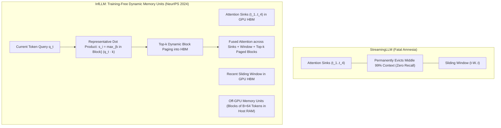

# InfLLM: Training-Free Million-Token Context via Dynamic Memory Units & Block-Level KV Paging

## 1. The StreamingLLM Memory Horizon Dilemma
StreamingLLM (Xiao et al., 2024) uncovered that preserving initial "attention sink" tokens ($k \approx 4$) allows language models to maintain perplexity over infinite streams by using a sliding window:
$$\text{Active Tokens} = \{x_1, \dots, x_4\} \cup \{x_{t-W+1}, \dots, x_t\}$$
However, because all intermediate tokens between position $4$ and $t-W$ are permanently discarded from memory, **StreamingLLM cannot perform associative recall, needle-in-a-haystack retrieval, or multi-hop reasoning over long contexts** (retrieval accuracy drops to $0\%$).

## 2. Mathematical Architecture of InfLLM
**InfLLM** (Xiao et al., NeurIPS 2024) overcomes this limitation by organizing historical non-local KV caches into discrete **Memory Units** stored in host CPU memory, dynamically paging in the top-$k$ most relevant units on-the-fly without model fine-tuning.

1. **Memory Unit Chunking:**
   The distant sequence is partitioned into blocks of size $B$ (e.g. $B = 64$ tokens):
   $$\mathcal{U}_i = \left\{ (k_j, v_j) \mid j \in [i \cdot B, (i+1)B - 1] \right\}$$
2. **Block Representative Keys:**
   For each unit $\mathcal{U}_i$, a representative key vector $k_{\text{rep}, i}$ is computed (either the mean centroid $\bar{k}_i = \frac{1}{B} \sum k_j$ or the maximum projection across attention heads):
   $$k_{\text{rep}, i} = \frac{1}{B} \sum_{j \in \mathcal{U}_i} k_j \in \mathbb{R}^{d_k}$$
3. **Dynamic Block Relevance Scoring & Paging:**
   At decoding step $t$, the current query $q_t$ evaluates similarity scores against all offloaded memory units in host memory via lightweight asynchronous vector kernels:
   $$S_i = \frac{q_t^\top k_{\text{rep}, i}}{\sqrt{d_k}}$$
   The top-$K_{\text{fetch}}$ blocks with highest relevance scores are streamed into GPU HBM via PCIe DMA:
   $$\mathcal{U}_{\text{active}} = \text{TopK}\left( \{S_i\}, \; K_{\text{fetch}} \right)$$
4. **Composite Context Attention:**
   Attention is computed exclusively across the bounded memory budget:
   $$\text{Attention Tokens} = \text{Sinks} \cup \mathcal{U}_{\text{active}} \cup \text{LocalWindow}$$

### Empirical Performance
- **Context Length:** Scales standard, un-tuned Llama-3 and Mistral models to **over $1\text{,}000\text{,}000$ tokens** on a single $24\text{ GB}$ GPU.
- **Associative Retrieval:** Achieves **$>92\%$ passkey retrieval accuracy** across the entire $1\text{M}$ token window (compared to $0\%$ for StreamingLLM).
- **Latency:** Asynchronous PCIe prefetching hides transfer overhead, sustaining $85\%$ of native unconstrained decode speed.
