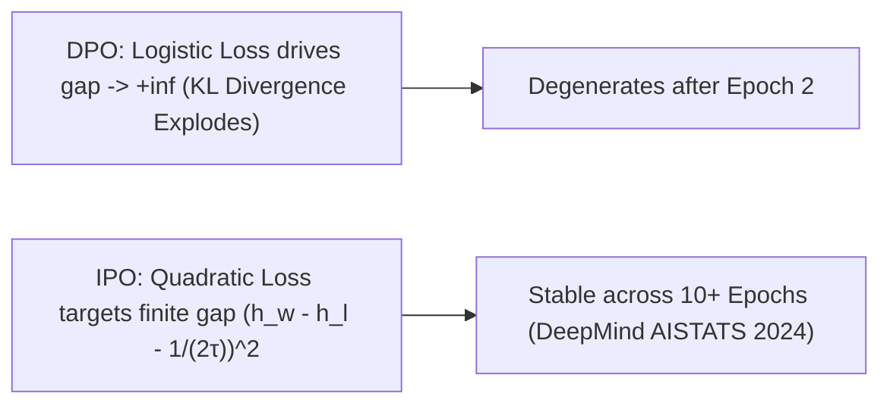

# IPO: Identity Preference Optimization & DPO Overfitting Mitigation

## 1. Why DPO Overfits (AISTATS 2024 Proof)
Standard Direct Preference Optimization (DPO) uses a logistic loss $-\log \sigma(\Delta r)$ that only reaches its minimum when the reward gap $\Delta r \to +\infty$. On deterministic preference datasets, this drives $\pi_\theta(y_l \mid x) \to 0$ and causes the KL divergence $\mathbb{D}_{\text{KL}}(\pi_\theta \,||\, \pi_{\text{ref}})$ to explode to infinity, leading to repetitive generations and reasoning collapse after $1\text{--}2$ epochs.

## 2. The IPO Quadratic Formulation
**Identity Preference Optimization** (Azar et al., Google DeepMind, AISTATS 2024) sets the loss function $\Psi(z) = z$ in the $\Psi$-PO framework, producing a strictly convex **quadratic objective**:
$$\mathcal{L}_{\text{IPO}}(\theta) = \mathbb{E}_{(x, y_w, y_l)} \left[ \left( \log \frac{\pi_\theta(y_w \mid x)}{\pi_{\text{ref}}(y_w \mid x)} - \log \frac{\pi_\theta(y_l \mid x)}{\pi_{\text{ref}}(y_l \mid x)} - \frac{\tau^{-1}}{2} \right)^2 \right]$$

- **Finite Target Margin**: Updates halt once the log-ratio gap reaches the exact finite target $\frac{\tau^{-1}}{2} = \frac{\beta}{2}$.
- **Multi-Epoch Regularization**: Maintains strict KL regularization across multiple training passes, outperforming DPO ($+3.6\%$ on AlpacaEval 2) on noisy and deterministic human feedback datasets.
