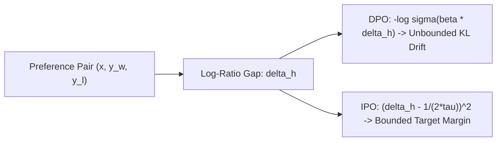

# Identity Preference Optimization (IPO) & $\Psi$PO Paradigm

## The DPO Over-Fitting Pathology
Direct Preference Optimization (DPO) replaces reinforcement learning with a closed-form Bradley-Terry cross-entropy loss:
$$\mathcal{L}_{\text{DPO}}(\theta) = -\mathbb{E} \left[ \log \sigma \left( \beta \log \frac{\pi_\theta(y_w \mid x)}{\pi_{\text{ref}}(y_w \mid x)} - \beta \log \frac{\pi_\theta(y_l \mid x)}{\pi_{\text{ref}}(y_l \mid x)} \right) \right]$$
Azar et al. (Google DeepMind, AISTATS 2024 / arXiv:2310.12036) prove that because human preferences contain stochastic label noise, DPO's loss gradient $\sigma(-u)$ drives the implicit log-ratio gap $u \to +\infty$ on separable pairs. This causes uncontrolled KL divergence explosion $D_{\text{KL}}(\pi_\theta \parallel \pi_{\text{ref}}) \to \infty$, loss of generative diversity, and catastrophic reasoning collapse.

## The General $\Psi$PO Framework & IPO Loss
Azar et al. introduce $\Psi$-Preference Optimization ($\Psi$PO):
$$\max_{\pi} \mathbb{E}_{x \sim \mathcal{D}, y, y' \sim \pi} \left[ \Psi\left( P(y \succ y' \mid x) - \frac{1}{2} \right) \right] - \tau D_{\text{KL}}(\pi \parallel \pi_{\text{ref}})$$
Setting identity non-linearity $\Psi(t) = t$ yields **Identity Preference Optimization (IPO)**:
$$\mathcal{L}_{\text{IPO}}(\theta) = \mathbb{E}_{(x, y_w, y_l) \sim \mathcal{D}} \left[ \left( \log \frac{\pi_\theta(y_w \mid x)}{\pi_{\text{ref}}(y_w \mid x)} - \log \frac{\pi_\theta(y_l \mid x)}{\pi_{\text{ref}}(y_l \mid x)} - \frac{1}{2\tau} \right)^2 \right]$$

## Mathematical Properties & Regularization
1. **Target Margin Enforcement:** The squared loss drives the log-ratio difference toward exact finite target margin $\frac{1}{2\tau}$, eliminating gradient vanishing and unbounded drift.
2. **Noise Robustness:** Contradictory labels average out in $L_2$ space rather than triggering divergence.
3. **KL Divergence Bound:** Prevents mode collapse, preserving pretraining syntax and downstream reasoning capabilities.

Related: [[preference_alignment_engineer]], [[self_improving_alignment_and_meta_rewarding]], [[kto_prospect_theory_alignment]]
