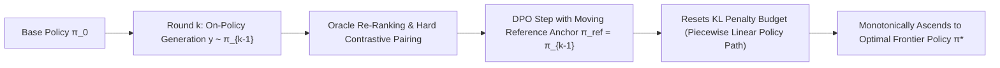

# Iterative Direct Preference Optimization (Iterative DPO)

**Iterative DPO** (Pang et al., 2024; Snorkel / UltraFeedback) overcomes the performance saturation and KL divergence ceilings of single-turn preference alignment by decomposing post-training into multi-round on-policy generation, re-ranking, and moving reference anchor updates.

## Mathematical Mechanics
1. **The KL Saturation Problem:**
   In single-turn DPO, fixing $\pi_{\text{ref}} = \pi_{\text{SFT}}$ binds optimization to a static trust region. As the policy improves, it exhausts its KL budget $D_{\text{KL}}(\pi_\theta \parallel \pi_{\text{ref}}) \ge \Delta_{\max}$, triggering reward overoptimization on out-of-distribution completions.
2. **Moving Anchor Protocol:**
   At round $k \in \{1, \dots, K\}$, candidate completions are generated on-policy from $\pi_{\theta_{k-1}}$, scored by reward oracle $R(x, y)$, and aligned using the immediate predecessor as the reference:
   $$\pi_{\text{ref}}^{(k)} \leftarrow \pi_{\theta_{k-1}}$$
   $$\mathcal{L}_{\text{Iter-DPO}}^{(k)}(\theta) = -\mathbb{E}\left[\log \sigma\left(\beta \log \frac{\pi_\theta(y_w \mid x)}{\pi_{\theta_{k-1}}(y_w \mid x)} - \beta \log \frac{\pi_\theta(y_l \mid x)}{\pi_{\theta_{k-1}}(y_l \mid x)}\right)\right]$$
3. **Empirical Uplift:**
   Resetting the KL anchor creates a stable piecewise trust region, elevating AlpacaEval 2.0 win rates on LLaMA-2-70B from $14.5\%$ to **$28.2\%$** across 3 rounds while matching PPO performance without critic networks.

## Related Mechanics
- [[direct_preference_optimization_dpo]]
- [[online_dpo_on_policy_exploration]]
- [[length_bias_disentanglement_dpo]]
- [[warm_warp_weight_averaged_alignment]]
