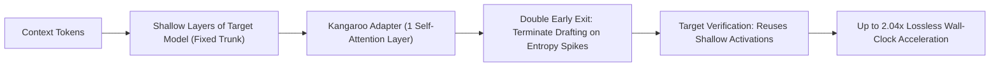

# Kangaroo: Self-Speculative Decoding

Kangaroo (Liu et al., 2024) is a lossless self-speculative decoding framework that accelerates inference using a fixed sub-network of the target model without requiring external draft models.

## Core Mechanics
1. **Lightweight Self-Drafting Sub-Network:** Utilizes the early layers of the target model paired with a minimal single-layer self-attention adapter, completely removing the memory and deployment footprint of external draft models.
2. **Double Early Exit:**
   - *Drafting Exit:* Halts speculative token generation dynamically when predictive uncertainty exceeds an empirical threshold, avoiding speculative errors on hard tokens.
   - *Verification Exit:* Reuses cached activations from shallow layers during target verification, skipping forward compute for early layers.
3. **Hardware Efficiency:** Delivers up to **$2.04\times$ lossless speedup** while reducing peak memory bandwidth bottlenecks.

Related: [[medusa_speculative_tree_attention]], [[lookahead_decoding_jacobi_iteration]], [[eagle2_recurrent_feature_speculation]], [[domino_grammar_speculative_decoding]]
