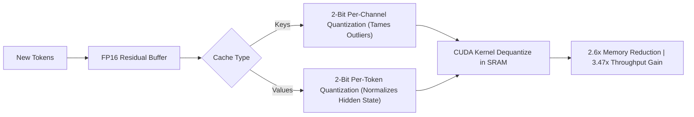

# KIVI: 2-Bit Asymmetric KV Cache Quantization

KIVI (Liu et al., 2024) is a tuning-free, asymmetric 2-bit quantization algorithm designed to compress multi-gigabyte KV caches without degrading reasoning accuracy.

## Core Mechanics
1. **Asymmetric Quantization Geometry:**
   - *Key Cache:* Quantized to 2 bits **per channel** across tokens to absorb sharp cross-token channel activation outliers.
   - *Value Cache:* Quantized to 2 bits **per token** across the hidden dimension, reflecting its continuous distribution.
2. **Streaming Residual Buffer:** Recent tokens are preserved in a full-precision FP16 buffer before undergoing block quantization, preventing truncation noise on immediate context.
3. **Hardware Acceleration:** Custom CUDA kernels execute fused dequantization directly inside GPU SRAM during attention GEMMs, delivering full FP16 accuracy parity on LongBench while reducing VRAM footprint by $2.6\times$.

Related: [[bitnet_b158_ternary_architecture]], [[pyramidkv_hierarchical_attention_funnel]], [[duoattention_retrieval_streaming_heads]], [[snapkv_attention_clustering]]
