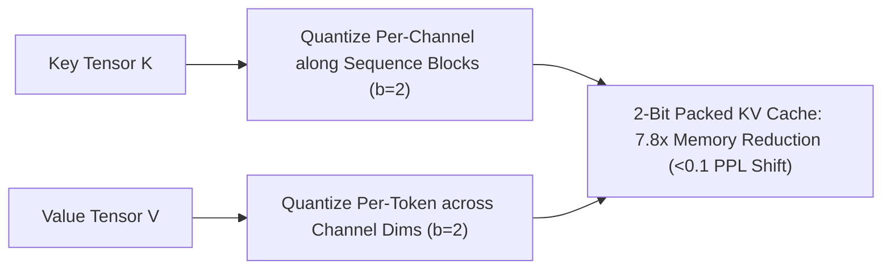

# KIVI: Tuning-Free Asymmetric 2-Bit KV Cache Quantization

## 1. The Key-Value Outlier Asymmetry
Compressing dynamic KV cache tensors below 4 bits historically caused catastrophic perplexity explosions under symmetric quantization. **KIVI** (Liu et al., UC Berkeley, ICML 2024) uncovers a fundamental structural asymmetry in attention tensors:
- **Keys ($K$) exhibit per-channel outliers:** Specific feature channels maintain massive magnitudes across all sequence tokens, but within each channel, values are smoothly distributed.
- **Values ($V$) exhibit per-token outliers:** Specific tokens (delimiters, sinks) exhibit large norm spikes across all channels simultaneously.

## 2. Mathematical Formulation & Streaming Residual
1. **Keys (Per-Channel Block Quantization):** For channel $c$ and sequence block $g$:
   $$\hat{K}_{t, c} = \text{clamp}\left(\text{round}\left(\frac{K_{t, c}}{\Delta_{c, g}^K}\right) + Z_{c, g}^K, \; 0, \; 2^b - 1\right)$$
2. **Values (Per-Token Quantization):** For token $t$:
   $$\hat{V}_{t, c} = \text{clamp}\left(\text{round}\left(\frac{V_{t, c}}{\Delta_{t}^V}\right) + Z_{t}^V, \; 0, \; 2^b - 1\right)$$
3. **FP16 Streaming Buffer:** Preserves the most recent $L_{\text{win}} = 64$ tokens in FP16 to maintain local attention precision.

- **Empirical Impact:** Reduces KV cache memory by **$7.8\times$** (enabling 128k context on single GPUs), increases serving batch size by **$4\times\text{--}8\times$**, and delivers **$2.6\times$ decode speedup** with $<0.09$ perplexity shift on Llama-2-70B.
