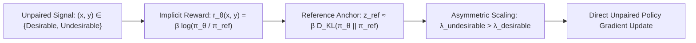

# Kahneman-Tversky Optimization (KTO): Unpaired Preference Alignment

## 1. Unpaired Feedback & Prospect Theory
While DPO requires paired counterfactuals $(x, y_w, y_l)$, real-world feedback is almost exclusively **unpaired and binary** (thumbs-up/down, accept/reject). **KTO** (Ethayarajh et al., Stanford & Contextual AI, ICML 2024) replaces the Bradley-Terry ranking model with **Daniel Kahneman & Amos Tversky's Prospect Theory (1979)**, anchoring updates to an implicit reference point with human loss aversion.

## 2. Mathematical Formulation
Given implicit reward $r_\theta(x, y) = \beta \log \frac{\pi_\theta(y \mid x)}{\pi_{\text{ref}}(y \mid x)}$ and reference point $z_{\text{ref}} = \mathbb{E}[r_\theta(x', y')]$:
$$v_{\text{KTO}}(x, y) = \begin{cases} 1 - \sigma\left(\lambda_D (r_\theta(x, y) - z_{\text{ref}})\right) & \text{if desirable} \\ 1 - \sigma\left(\lambda_U (z_{\text{ref}} - r_\theta(x, y))\right) & \text{if undesirable} \end{cases}$$
where loss aversion parameter $\lambda_U > \lambda_D$ penalizes undesirable outputs more sharply than it rewards desirable outputs.

The global training objective is:
$$\mathcal{L}_{\text{KTO}}(\theta) = \mathbb{E}_{(x, y)} \left[ w(y) \left( 1 - \sigma\left(\lambda_y \left(\beta \log \frac{\pi_\theta(y \mid x)}{\pi_{\text{ref}}(y \mid x)} - z_{\text{ref}}\right)\right)\right)\right]$$

- **Performance & Cost:** Matches or outperforms DPO on AlpacaEval 2.0 ($18.6\%$ vs $17.8\%$) and GSM8k ($57.8\%$ vs $54.2\%$) while reducing dataset curation costs by $2.5\times\text{--}4\times$ by eliminating pairwise generation overhead.
