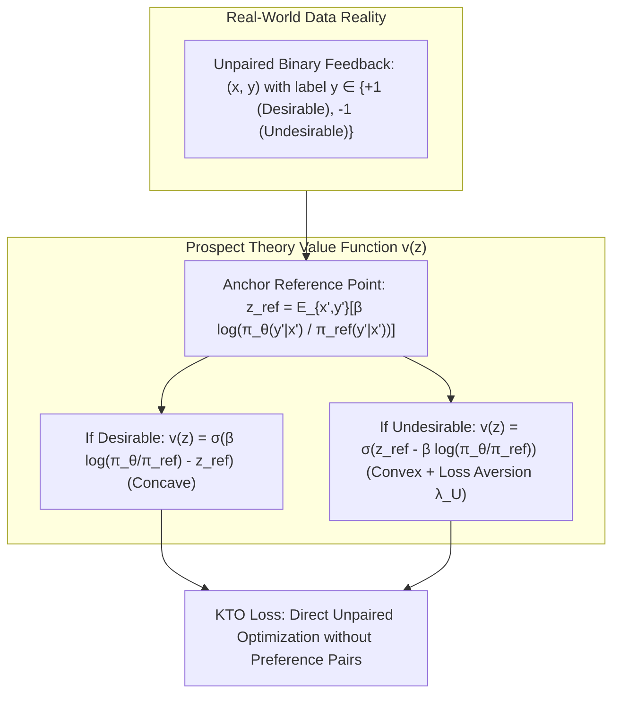

# KTO: Kahneman-Tversky Optimization — Prospect Theory for LLM Alignment

## 1. The Fallacy of Expected Utility in Preference Alignment
Traditional RLHF and DPO methods assume the **von Neumann-Morgenstern utility theory** and Bradley-Terry preference pairs $(x, y_w, y_l)$. However, this paradigm exhibits two severe practical and theoretical flaws:
1. **Paired Data Scarcity:** Real-world product telemetry yields unpaired binary signals (e.g. user copy/pasting code vs clicking regenerate, upvotes vs downvotes), not neatly paired counterfactual responses. Constructing pairs is expensive and noisy.
2. **Behavioral Inaccuracy of Expected Utility:** Decades of behavioral economics demonstrate that humans systematically violate expected utility. Human decision-making is governed by **Kahneman & Tversky's Prospect Theory (1979)**, exhibiting:
   - **Reference Dependence:** Utility is judged relative to an anchor reference point $z_{\text{ref}}$, not in absolute terms.
   - **Loss Aversion:** Negative outcomes induce roughly twice the psychological displeasure as equivalent positive gains ($\lambda_{\text{loss}} > \lambda_{\text{gain}}$).
   - **Diminishing Sensitivity:** Subjective valuation is concave for gains and convex for losses.

## 2. Mathematical Formulation of KTO
**Kahneman-Tversky Optimization (KTO)** (Ethayarajh et al., ICML 2024) maximizes human utility directly on unpaired binary datasets $\mathcal{D} = \mathcal{D}_D \cup \mathcal{D}_U$:

1. **Implicit Reward & Reference Anchor:**
   Let $r_\theta(x, y) = \beta \log \frac{\pi_\theta(y \mid x)}{\pi_{\text{ref}}(y \mid x)}$. The dynamic reference point is the expected reward under the policy:
   $$z_{\text{ref}} = \mathbb{E}_{x \sim \mathcal{D}, y \sim \pi_\theta} \left[ r_\theta(x, y) \right] \approx \frac{1}{B} \sum_{i=1}^B \beta \text{KL}\left(\pi_\theta(y_i \mid x_i) \parallel \pi_{\text{ref}}(y_i \mid x_i)\right)$$
2. **KTO Objective Function:**
   $$\mathcal{L}_{\text{KTO}}(\theta) = \mathbb{E}_{(x, y) \in \mathcal{D}_D} \left[ 1 - \sigma\left( r_\theta(x, y) - z_{\text{ref}} \right) \right] + \frac{\lambda_U}{\lambda_D} \mathbb{E}_{(x, y) \in \mathcal{D}_U} \left[ 1 - \sigma\left( z_{\text{ref}} - r_\theta(x, y) \right) \right]$$
   where $\lambda_D, \lambda_U$ are loss aversion multipliers (typically $\lambda_U / \lambda_D \in [1.33, 2.0]$).

### Empirical Performance
- **Unpaired Superiority:** Matches or exceeds DPO across Llama-3-8B and Mistral-7B on AlpacaEval 2.0 and GSM8K, despite training exclusively on unpaired binary data.
- **Robustness to Extreme Imbalance:** Retains stable convergence even when desirable data outnumbers undesirable data by $10:1$ ($90\%$ positive feedback).