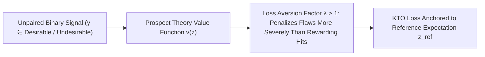

# KTO: Kahneman-Tversky Optimization

**Kahneman-Tversky Optimization (KTO)** aligns language models directly from unpaired binary signals (thumbs-up / thumbs-down) using a utility function grounded in behavioral economics and Prospect Theory.

## Mathematical Formalism
Given implicit reward $r_\theta(x, y) = \beta \log \frac{\pi_\theta(y \mid x)}{\pi_{\text{ref}}(y \mid x)}$ and baseline reference point $z_{\text{ref}} = \mathbb{E}[\beta \log(\pi_\theta/\pi_{\text{ref}})]$:
$$\mathcal{L}_{\text{KTO}}(\theta) = \mathbb{E}_{(x, y)}\left[w(y) \left(1 - v_{\text{kto}}\left(r_\theta(x, y) - z_{\text{ref}}\right)\right)\right]$$
where the asymmetric value function reflects human loss aversion ($\lambda \approx 1.33\text{--}2.0$):
$$v_{\text{kto}}(z) = \begin{cases} \sigma(z) & \text{if } y \text{ is desirable} \\ \sigma(-\lambda z) & \text{if } y \text{ is undesirable} \end{cases}$$

KTO matches or exceeds DPO win rates on standard benchmarks while operating with extreme sample efficiency on production telemetry where unpaired binary ratings far exceed curated paired preferences.

## Related Mechanics
- [[direct_preference_optimization_dpo]]
- [[orpo_odds_ratio_preference_optimization]]
- [[reinforcement_learning_human_feedback]]
