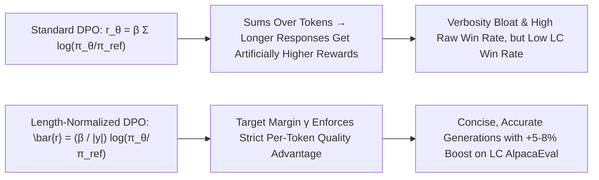

# Length Bias Disentanglement in Direct Preference Optimization

**Length Bias in DPO** stems from implicit reward accumulation over token sequences, causing policy optimization to reward response verbosity ("verbosity hacking") rather than reasoning quality. Length-normalized objectives eliminate this pathology by scoring per-token average log-likelihoods and incorporating explicit target margins.

## Mathematical Formalism
1. **Linear Length Scaling Exploit:**
   $$r_{\text{DPO}}(x, y) = \beta \sum_{t=1}^{|y|} \log \frac{\pi_\theta(y_t \mid x, y_{<t})}{\pi_{\text{ref}}(y_t \mid x, y_{<t})} \approx \beta \cdot |y| \cdot \epsilon$$
2. **Length-Normalized Reward with Target Margin:**
   $$\bar{r}_\theta(x, y) = \frac{\beta}{|y|} \log \frac{\pi_\theta(y \mid x)}{\pi_{\text{ref}}(y \mid x)}$$
   $$\mathcal{L}_{\text{LN-DPO}}(\theta) = -\mathbb{E}_{(x, y_w, y_l)}\left[\log \sigma\left(\bar{r}_\theta(x, y_w) - \bar{r}_\theta(x, y_l) - \gamma\right)\right]$$
   Normalizing by length $|y|$ eliminates the artificial incentive to emit redundant padding tokens, reducing inference latency by $20\%\text{--}35\%$ and closing the discrepancy between raw and length-controlled (LC) win rates.

## Related Mechanics
- [[direct_preference_optimization_dpo]]
- [[simpo_reference_free_margin_alignment]]
- [[reward_overoptimization_goodhart_law]]
