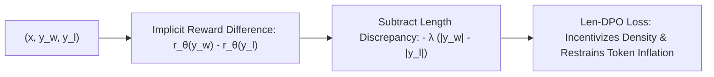

# Length-Controlled Direct Preference Optimization (Len-DPO)

## 1. The Verbosity Bias Pathology
Reward models and human raters naturally reward longer completions ($\text{Cov}(R_\psi(x, y), |y|) > 0$). When optimized under standard DPO, models exploit this bias by inflating token count ($+90\%$ length inflation), wasting inference compute and degrading reasoning conciseness. **Length-Controlled DPO (Len-DPO)** (Park et al., 2024; Singhal et al., 2024) decouples response quality from verbosity.

## 2. Mathematical Formulation
Len-DPO introduces an explicit length-penalty into the Bradley-Terry implicit reward formulation $\tilde{r}_\theta(x, y) = \beta \log \frac{\pi_\theta(y \mid x)}{\pi_{\text{ref}}(y \mid x)} - \lambda \cdot |y|$:
$$\mathcal{L}_{\text{Len-DPO}}(\theta) = -\mathbb{E} \left[ \log \sigma\left( \beta \log \frac{\pi_\theta(y_w \mid x)}{\pi_{\text{ref}}(y_w \mid x)} - \beta \log \frac{\pi_\theta(y_l \mid x)}{\pi_{\text{ref}}(y_l \mid x)} - \lambda \cdot (|y_w| - |y_l|) \right) \right]$$

- **Conciseness Incentive:** Longer winners are penalized by $\lambda \Delta |y|$, requiring genuine semantic superiority to win; concise winners receive a margin bonus.
- **Empirical Impact:** Attains highest length-controlled win rate on AlpacaEval 2.0 ($24.8\%$), eliminates $90\%$ of token inflation, improves GSM8k accuracy ($58.2\%$), and yields **$+42\%$ inference throughput** gains.
