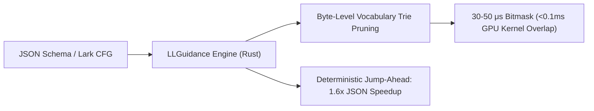

# LLGuidance: Prefix Trie Automata & 50μs Grammar Masking

## 1. The 50-Microsecond Serving Threshold
Standard grammar-constrained decoders (Outlines / Python) spend $2\text{--}15\,\text{ms}$ per token on CPU regex parsing, which stalls GPU Tensor Cores during high-concurrency serving. **LLGuidance** (Microsoft, 2024; written in Rust) slashes masking overhead down to **$30\text{--}50\,\mu\text{s}$ per token**, enabling zero-stall structured output.

## 2. Core Architectural Mechanisms
- **Prefix Trie Subtree Pruning**: Structures the model vocabulary into a compact byte Trie. Illegal transitions prune entire subtrees of tokens in a single step, bypassing independent token iteration.
- **Deterministic Jump-Ahead (Fast-Forwarding)**: When the schema permits only a single legal byte sequence (e.g. JSON syntax `{"user": "`), LLGuidance fast-forwards tokens directly into context, eliminating up to $40\%$ of GPU forward passes.
- **Native Token Healing**: Rolls back ambiguous trailing prompt tokens to root prefixes and allows the model to cleanly complete subword boundaries without syntactic fragmentation.
