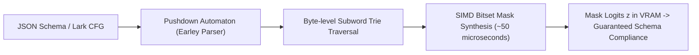

# Microsoft LLGuidance & Pushdown Automata Decoding

## Sub-50 Microsecond Grammar Masking
Microsoft's **LLGuidance** (`guidance-ai/llguidance`) is a Rust-native constrained decoding engine powering **OpenAI Structured Outputs**, vLLM, SGLang, and llama.cpp. It solves the CPU serialization bottleneck of grammar parsing, reducing per-token masking overhead from $30\text{ ms}$ down to **$\sim 50\,\mu\text{s}$**.

## Pushdown Automata & Earley Parsing
While flat Deterministic Finite Automata (DFAs) fail on recursive structures ($L = \{a^n b^n\} \notin \text{REG}$), LLGuidance compiles Lark context-free grammars and JSON schemas into an intermediate **Pushdown Automaton (PDA)** executing an optimized Earley chart parser. 

It maintains dotted production items ($A \to \alpha \cdot B \beta$) along an explicit non-terminal stack and evaluates lexical terminals via Brzozowski regular expression derivatives:
$$\partial_c R = \{w \mid cw \in R\}$$
supporting arbitrary nested JSON objects, SQL queries, and ASTs without state explosion.

## Subword Trie Traversal & Token Fast-Forwarding
- **Subword Prefix Trie:** Pre-indexes vocabulary $\mathcal{V}$ ($|V| \ge 128\text{k}$) into a compact character trie. Pruning branches yielding empty derivatives eliminates exhaustive $\mathcal{O}(|V|)$ checks.
- **Token Fast-Forwarding:** Deterministic syntax states (entropy $\mathcal{H}=0$) bypass the GPU forward pass, splicing static tokens directly into the Key-Value cache.

Related: [[constrained_decoding_architect]], [[xgrammar_zero_overhead_constrained_decoding]], [[token_healing_subword_boundary_synchronization]]
