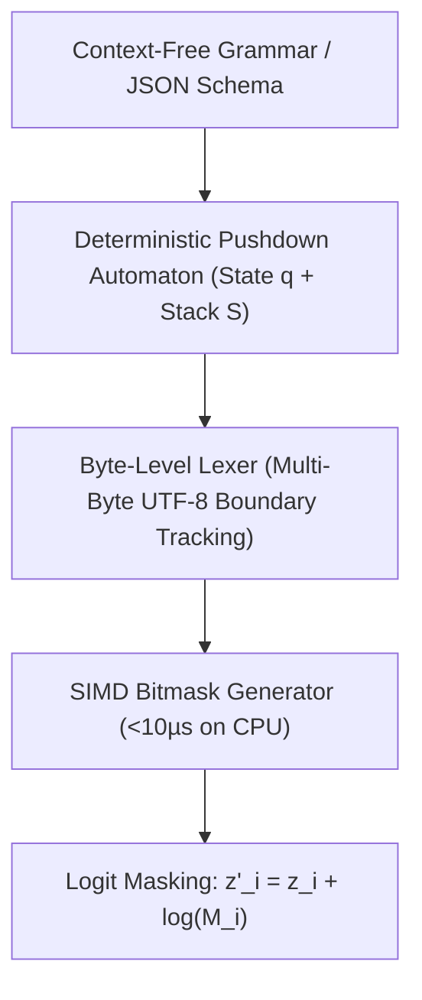

# LLGuidance: Fast CFG Constrained Decoding with Pushdown Automata

**LLGuidance** (Microsoft / Guidance AI, 2024) advances structured generation beyond finite-state machine (FSM/DFA) limitations by compiling arbitrary Context-Free Grammars (CFGs), EBNF, and JSON Schemas into optimized pushdown automata capable of parsing nested syntax in sub-10 microsecond latency.

## Mathematical Mechanics
1. **Pushdown Automaton Parser:** Maintains an execution configuration $C_t = (q_t, \gamma_t)$ where state $q_t \in Q$ and stack $\gamma_t \in \Gamma^*$ dynamically store ancestor scope frames, overcoming DFA inability to parse recursive structures like $a^n b^n$ or deeply nested JSON dictionaries.
2. **Byte-Level UTF-8 Boundary Tracking:** Because BPE tokenizers frequently split multi-byte Unicode codepoints across token boundaries, LLGuidance tracks partial byte sequences:
   $$\text{State}_{\text{UTF-8}}(C_{t+1}) = \text{ValidateUTF8}\left(\text{PartialBytes}(C_t) \circ \text{Bytes}(t)\right)$$
3. **SIMD-Accelerated Bitmask Generation:** Generates boolean token validity bitmasks $M \in \{0, 1\}^{|\mathcal{V}|}$ over 128k–256k vocabularies in parallel on the CPU ($<10\,\mu\text{s}$) concurrently with GPU matrix multiplications, ensuring zero wall-clock latency overhead during constrained decoding.

## Related Mechanics
- [[constrained_decoding_grammar_masks]]
- [[outlines_dfa_regex_constrained_decoding]]
- [[xgrammar_hardware_accelerated_decoding]]
- [[token_healing_boundary_mechanics]]
