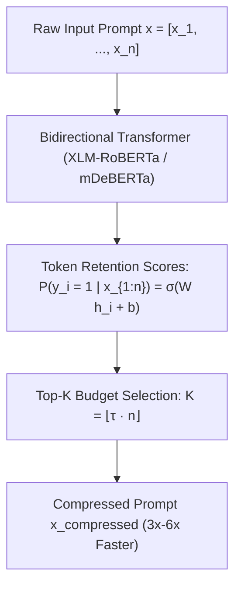

# LLMLingua-2: Bidirectional Token Classification for Prompt Compression

**LLMLingua-2** overcomes the fundamental computational and architectural limits of earlier causal prompt compressors (such as LLMLingua-1 and Selective Context) by reformulating prompt compression as a sequence labeling token classification task powered by a lightweight bidirectional encoder.

## Mathematical Mechanics
1. **Bidirectional Information Density:** Unlike causal autoregressive models that measure next-token conditional perplexity $P(x_i \mid x_{<i})$, LLMLingua-2 conditions retention probability on the entire bidirectional sequence context:
   $$P(y_i = 1 \mid x_1, \dots, x_n) = \sigma\left(W_{\text{cls}} h_i + b_{\text{cls}}\right)$$
2. **Chunk-Level Distillation:** Training annotations are synthesized by extracting compression traces from GPT-4 and aligning them back to original token indices using chunk-level string matching.
3. **Budget Pruning:** Given token budget ratio $\tau$, the model extracts the $K = \lfloor \tau \cdot n \rfloor$ highest-scoring tokens, maintaining original syntactic order.
4. **Empirical Efficiency:** Runs 3× to 6× faster than LLMLingua-1 while maintaining up to 98% reasoning performance across MeetingBank, LongBench, and GSM8K at 2×–5× compression ratios.

## Related Mechanics
- [[context_compression_mechanics]]
- [[selective_context_compression]]
- [[longllmlingua_question_aware_compression]]
- [[kv_cache_eviction_mechanics]]
