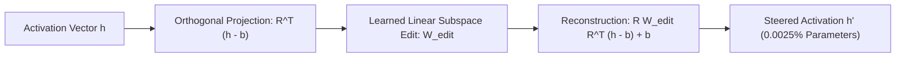

# Representation Finetuning (LoReFT)

Representation Finetuning (ReFT; Wu, Manning et al., Stanford 2024) freezes all foundation model weights and intervenes directly on intermediate hidden representations in low-rank linear subspaces.

## Mathematical Mechanics
$$\Phi(h) = h + R \left(W_{\text{edit}} R^T (h - b) + b - R^T h\right)$$
1. **Low-Rank Subspace Parameterization:** Parameterized by an orthogonal projection matrix $R \in \mathbb{R}^{d \times r}$ ($r \ll d$) and learned bias $b$, editing activations only at specific token positions and layers.
2. **Causal Abstraction Grounding:** Grounded in mechanistic interpretability, editing semantic concepts directly in representation space rather than modifying model weight matrices.
3. **Extreme Parameter Efficiency:** Operates with **$10\times\text{--}50\times$ fewer parameters than LoRA**, achieving state-of-the-art instruction following and mathematical reasoning with under $0.01\%$ trainable parameter budgets.

Related: [[representation_engineering_repe]], [[circuit_breakers_representation_rerouting]], [[model_abliteration_refusal_geometry]], [[proxy_tuning_logit_arithmetic]]
