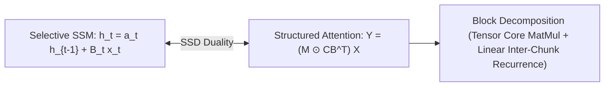

# Mamba-2: Structured State Space Duality (SSD)

The **Structured State Space Duality (SSD)** framework establishes a mathematical bridge between selective State Space Models (SSMs) and structured linear attention via 1-semiseparable matrix algebra.

## Mathematical Formalism
SSD identifies state space recurrence:
$$h_t = a_t h_{t-1} + B_t x_t, \quad y_t = C_t h_t$$
as identical to causal masked linear attention:
$$Y = \left(M \circ \left(C B^\top\right)\right) X, \quad M_{ij} = \prod_{k=j+1}^i a_k$$
where queries correspond to $C$, keys to $B$, and values to $X$.

By partitioning sequences into chunks of size $Q$, SSD computes intra-chunk operations via high-throughput GPU matrix multiplications on Tensor Cores, while inter-chunk states propagate through associative linear scans. Mamba-2 introduces multi-head SSM structures (MHA/GQA/MQA parallels), expanding state dimension $N \in [64, 256]$ and yielding 2–8× throughput acceleration over Mamba-1.

## Related Mechanics
- [[mamba_selective_state_spaces]]
- [[flash_attention_mechanics]]
- [[linear_attention_mechanisms]]
