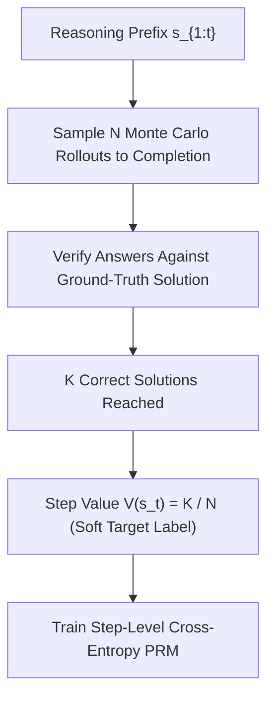

# Math-Shepherd Process Reward Models

Math-Shepherd (Wang et al., ACL 2024) automates step-level process supervision for complex mathematical reasoning without requiring human annotations.

## Core Mechanics
1. **Automated Step Labeling:** Given problem $x$ and intermediate step $s_t$, a generator policy executes $N$ Monte Carlo rollouts. Each rollout terminates in an answer checked against ground-truth verification.
2. **Intermediate State-Value Estimation:** Soft supervision assigns target probability $l_t = K / N$ where $K$ is the number of valid rollouts, directly learning the step-level value function $V(s_{1:t})$.
3. **Best-of-N Guidance:** Powers step-level beam search and Best-of-$N$ reranking, systematically identifying reasoning deviations before full trajectory generation concludes.

## Benchmark Metrics
- Significantly outperforms traditional Outcome Reward Models (ORMs) on MATH and GSM8K.
- Provides scalable training data for step-level PPO and Monte Carlo Tree Search (MCTS) reasoning engines.

Related: [[rlvr_verifiable_rewards_grpo]], [[s1_budget_forcing_test_time]], [[self_consistency_majority_voting]]
