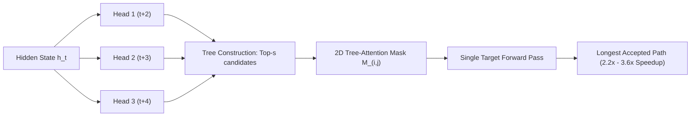

# Medusa: Speculative Tree-Attention Verification with Multi-Decoding Heads

## Multi-Decoding Heads Architecture
Standard speculative decoding requires hosting and synchronizing a secondary draft model in GPU VRAM. **Medusa** (Cai et al., ICML 2024 / arXiv:2401.10774) eliminates draft models by augmenting the frozen target transformer backbone with $K$ residual prediction heads:
$$h_t^{(k)} = h_t + \operatorname{SiLU}\left( W_{k, 1} h_t \right)$$
$$P(x_{t+k+1} \mid x_{\le t}) = \operatorname{Softmax}\left( W_U h_t^{(k)} \right)$$
where $h_t$ is the final hidden state of the backbone and $W_U$ is the shared unembedding matrix.
- **Medusa-1:** Freezes the backbone and trains only heads $\{W_{k, 1}\}_{k=1}^K$ ($<1\%$ parameter overhead).
- **Medusa-2:** Jointly fine-tunes backbone and heads using self-distillation to maximize speculative acceptance rates.

## 2D Tree-Attention Verification Kernel
Taking top-$s_k$ tokens from head $k$ yields candidate tree $\mathcal{T}$ with $N_{\text{tree}} = \prod s_k$ paths. To evaluate all candidate branches in parallel without cross-branch causal attention leakage, Medusa defines custom 2D Tree-Attention mask $M \in \{0, 1\}^{N \times N}$:
$$M_{i, j} = \begin{cases} 1 & \text{if node } j \text{ is ancestor of node } i \text{ in } \mathcal{T} \\ 0 & \text{otherwise} \end{cases}$$
The target model verifies all candidate tokens in a single batched forward pass. Greedy matching or rejection sampling accepts the longest valid prefix.

## Performance
Across Vicuna-7B/13B/33B and Zephyr-7B, Medusa delivers **$2.2\times\text{--}3.6\times$ wall-clock speedup** with zero KV cache duplication and exact mathematical distribution preservation.

Related: [[speculative_decoding_specialist]], [[kv_cache_optimizer]], [[lookahead_decoding_jacobi_iteration]]
