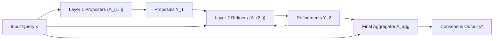

# Mixture-of-Agents (MoA) & Layered Collaborative Swarms

## Theoretical Foundations & Collaborative Phenomenon
**Mixture-of-Agents (MoA)** (Wang et al., Together AI, Duke, UChicago, Stanford, June 2024 / arXiv:2406.04692) operationalizes the **LLM Collaborativeness Phenomenon**: language models consistently synthesize higher-quality outputs when provided with candidate generations from auxiliary models, even when those auxiliary models have strictly lower individual benchmark capabilities.

Unlike single-layer majority voting or unstructured group-chat discussions that suffer from prompt bloat, MoA structures multi-agent collaboration into an $L$-layer feedforward directed acyclic graph (DAG).

## Mathematical Topology & Proposer-Aggregator Flow
Given user prompt $x$, MoA evaluates $L$ layers where layer $l \in \{1, \dots, L\}$ contains $M_l$ proposer agents $\{A_{l, 1}, \dots, A_{l, M_l}\}$:

1. **Layer 1 Initial Proposers:**
   $$y_{1, i} = A_{1, i}(x), \quad \forall i \in \{1, \dots, M_1\}$$
2. **Intermediate Layers $l \in \{2, \dots, L\}$:**
   Each agent $A_{l, i}$ receives query $x$ along with the aggregated response set $\mathcal{Y}_{l-1} = \{y_{l-1, j}\}_{j=1}^{M_{l-1}}$:
   $$y_{l, i} = A_{l, i}\left(x, \mathcal{Y}_{l-1}\right)$$
3. **Aggregator Synthesis:**
   A high-capacity aggregator model $A_{\text{agg}}$ extracts the optimal factual consensus:
   $$y^* = A_{\text{agg}}\left(x, \mathcal{Y}_L\right)$$

## Heterogeneous Diversity vs. Homogeneity
MoA performance is maximized when $\operatorname{Cov}(A_i, A_j) \to 0$ across proposers. Ensembling heterogeneous model families (e.g., Qwen-72B, Llama-3-70B, Mixtral-8x22B) achieves an **AlpacaEval 2.0 LC win rate of $65.1\%$**, outperforming GPT-4 Omni ($57.5\%$) and individual Llama-3-70B ($48.3\%$). Heterogeneous priors cancel individual hallucinations through cross-contextual critique.

Related: [[multi_agent_debate_consensus_elo]], [[test_time_compute_optimal_scaling]], [[agentic_memory_architect]]
