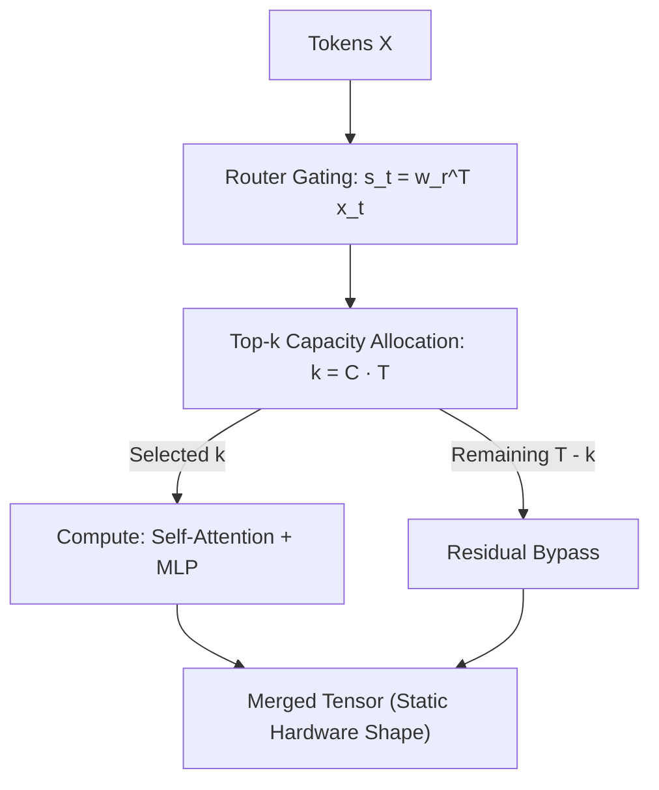

# Mixture-of-Depths (MoD): Conditional Computation via Token Routing

**Mixture-of-Depths (MoD)** introduces dynamic token-level capacity routing, allowing tokens to selectively bypass transformer blocks (attention and MLP) via residual connections.

## Mathematical Mechanics
To preserve static tensor shapes for GPU execution, MoD defines a sequence capacity $k = \lfloor C \cdot T \rfloor$, where capacity factor $C \in (0, 1]$ (typically $C = 0.5$):
$$R(x_t) = w_r^\top x_t, \quad \mathcal{T}_{\text{active}} = \text{Top-k}\left(\{R(x_t)\}_{t=1}^T, k\right)$$
Tokens outside $\mathcal{T}_{\text{active}}$ bypass the layer's compute operations:
$$y_t = \begin{cases} x_t + R(x_t) \cdot f_{\text{layer}}(x_t) & \text{if } t \in \mathcal{T}_{\text{active}} \\ x_t & \text{otherwise} \end{cases}$$
MoD achieves iso-FLOP parity with dense models while reducing forward-pass FLOPs by up to 50%, enabling faster autoregressive decoding and higher training throughput without degrading language modeling perplexity.

## Related Mechanics
- [[mixture_of_experts_routing]]
- [[early_exit_transformers]]
- [[kv_cache_eviction_mechanics]]
