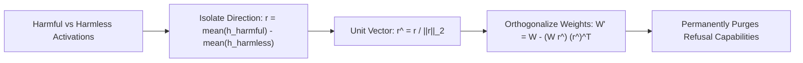

# Model Abliteration: Refusal Vector Orthogonalization

Model Abliteration (Arditi et al., 2024) removes safety refusal behavior permanently without fine-tuning by surgically orthogonalizing model weight matrices against a single one-dimensional refusal direction.

## Mathematical Mechanics
$$W_{\text{abl}} = W - W \hat{r} \hat{r}^T, \quad \hat{r} = \frac{r}{\|r\|_2}$$
1. **Refusal Direction Extraction:** Contrasting mean residual stream activations between harmful and harmless queries isolates a single, rank-1 vector $\hat{r} \in \mathbb{R}^d$ responsible for mediating refusal across layers.
2. **Weight Orthogonalization:** Projecting key weight matrices (attention output projections $W_O$ and MLP down-projections $W_{\text{down}}$) onto $\hat{r}$ and subtracting the component permanently destroys the model's geometric capacity to represent refusal features.
3. **Implications for AI Alignment:** Exposes the extreme geometric fragility of RLHF alignment: safety guardrails do not unlearn hazardous capabilities, but merely overlay a thin, one-dimensional geometric bypass.

Related: [[circuit_breakers_representation_rerouting]], [[representation_engineering_repe]], [[leace_closed_form_concept_erasure]], [[proxy_tuning_logit_arithmetic]]
