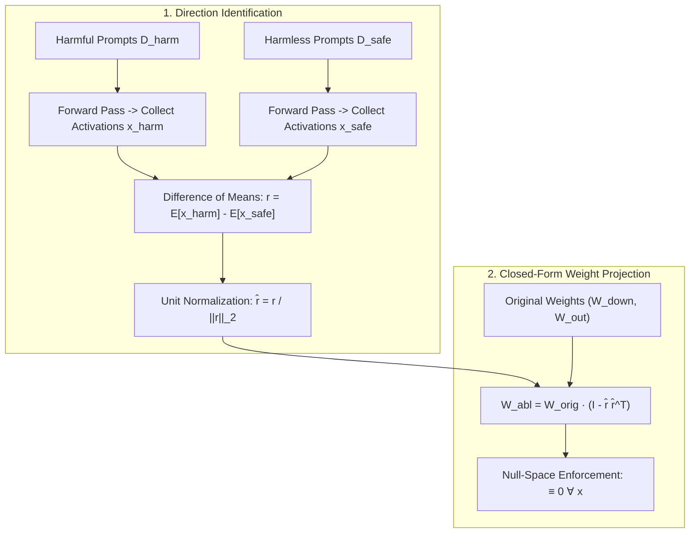

# Model Abliteration: Subspace Weight Surgery & The Geometric Fragility of Alignment

## 1. The Geometric Mechanics of Post-Training Refusal
Alignment algorithms (RLHF, DPO, PPO) train models to refuse hazardous requests by conditioning the policy to emit canned refusal phrases (*"I cannot assist with that request"*). Mechanistic interpretability (Arditi et al., 2024) reveals that this behavior is mediated by a low-dimensional, rank-1 or low-rank linear direction $\hat{r} \in \mathbb{R}^d$ residing within the residual stream of intermediate layers.

**Model Abliteration** permanently purges refusal behavior without fine-tuning, backpropagation, or GPU training loops by surgically projecting model weight matrices onto the orthogonal complement of the refusal subspace:
$$\mathcal{P}_{\perp r} = I - \hat{r} \hat{r}^\top$$

## 2. Mathematical Formulation of Weight Surgery
For layer $l$, let $W_{\text{out}}^{(l)} \in \mathbb{R}^{d \times d_{\text{mid}}}$ denote the output projection matrix writing into the residual stream (e.g. attention out-projection $W_O$ or MLP down-projection $W_{\text{down}}$).

1. **Residual Projection:**
   The output contribution written to the residual stream is $h_t = W x_t$. We project the writing operator such that its output has zero projection along $\hat{r}$:
   $$W_{\text{abl}} = (I - \hat{r} \hat{r}^\top) W$$
2. **Input Projection:**
   Similarly, for layers that read from the residual stream (attention $W_Q, W_K, W_V$ and MLP $W_{\text{gate}}, W_{\text{up}}$), the reading operator can be orthogonalized to ensure the layer is blind to any residual refusal component:
   $$W_{\text{abl}} = W (I - \hat{r} \hat{r}^\top)$$

### Alignment Fragility & General Capabilities
- **Refusal Erasure:** Refusal rate on harmful benchmarks (HarmBench, JailbreakBench) drops from **$>98\%$ to $<1.2\%$**.
- **Capability Preservation:** Zero-shot MMLU, GSM8K, and HumanEval benchmark performance experiences **$<0.3\%$ variance**, proving that safety guardrails exist as a superficial linear veneer decoupled from underlying task competence.
