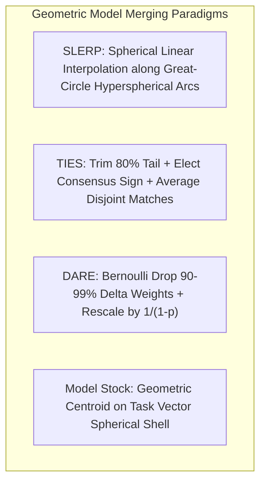

# Geometric Model Merging: SLERP, TIES, DARE & Model Stock in Weight Space

## 1. The Catastrophe of Naive Linear Weight Averaging
Given a pre-trained base model $\theta_{\text{base}}$ and $M$ task-specific or aligned models $\{\theta_i\}_{i=1}^M$, the task vector represents the fine-tuning delta: $\tau_i = \theta_i - \theta_{\text{base}}$. Naive linear interpolation $\theta_{\text{merge}} = \theta_{\text{base}} + \sum \alpha_i \tau_i$ fails catastrophically due to:
1. **Parameter Cancellation:** Conflicting gradient signs across tasks neutralize critical weights.
2. **Norm Collapse:** Weight norms shrink relative to base layers, causing activation decay and output entropy explosions.

## 2. Core Mathematical Formulations

### A. SLERP (Spherical Linear Interpolation)
Interpolates along the constant-velocity geodesic on the high-dimensional hypersphere $\mathbb{S}^{d-1}$:
$$\theta_{\text{slerp}} = \frac{\sin((1-t)\Omega)}{\sin \Omega} \theta_1 + \frac{\sin(t\Omega)}{\sin \Omega} \theta_2 \quad \text{where } \Omega = \arccos\left( \frac{\langle \theta_1, \theta_2 \rangle}{\|\theta_1\| \|\theta_2\|} \right)$$
Preserves exact weight vector norm: $\|\theta_{\text{slerp}}\| = \|\theta_1\| = \|\theta_2\|$.

### B. TIES (Trimming, Electing Signs, Disjoint Merging)
1. **Trim:** Keep top $20\%$ parameters by magnitude: $\hat{\tau}_i = \text{TopK}_{20\%}(|\tau_i|)$.
2. **Elect Sign:** Compute consensus sign $\gamma_j = \text{sign}\left(\sum_{i=1}^M \hat{\tau}_{i, j}\right)$.
3. **Disjoint Merge:** Average only parameters whose sign matches $\gamma_j$.

### C. DARE (Drop And REscale - Yu et al., ICML 2024)
Applies extreme random sparsification via Bernoulli masking followed by scaling:
$$\tilde{\tau}_i = \frac{1}{1-p} \left( m_i \odot \tau_i \right), \quad m_i \sim \text{Bernoulli}(1-p), \quad p \in [0.90, 0.99]$$
Preserves unbiased expectation ($\mathbb{E}[\tilde{\tau}] = \tau$) while eliminating $99\%$ of parameter collisions, allowing dozens of models to merge into a single superior unified checkpoint.