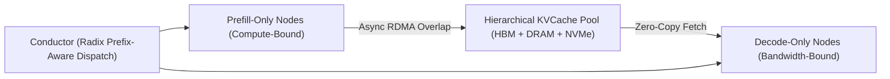

# Mooncake: KVCache-Centric Disaggregated LLM Serving Architecture

## 1. Decoupling Prefill and Decode with Global Memory Pools
Traditional LLM serving executes both compute-bound prefill and bandwidth-bound decode on the same GPUs, causing phase interference, GPU starvation, and high P99 latencies. **Mooncake** (Qin et al., Moonshot AI & Tsinghua, 2024; powering Kimi) decouples prefill and decode across dedicated clusters and places an elastic, distributed **KVCache Memory Pool** at the architectural center.

## 2. Multi-Tiered Storage Hierarchy & Asynchronous Transfer
Mooncake organizes memory into a 3-tiered virtual hierarchy:
1. **Tier 1 (GPU HBM):** Local high-throughput cache ($2\text{--}3.2 \text{ TB/s}$).
2. **Tier 2 (Host DRAM):** High-capacity RAM bridged via PCIe Gen 5 ($64\text{--}128 \text{ GB/s}$) and RDMA ($400\text{--}800 \text{ Gbps}$).
3. **Tier 3 (Local NVMe SSDs):** High-density flash storage for historical agent contexts.

- **Asynchronous Layer-by-Layer RDMA Streaming (Messenger):** Slices KV cache into blocks ($16\text{--}64$ tokens) and streams them over RDMA concurrently as downstream layers continue prefilling, hiding inter-node transfer latency ($t_{\text{overhead}} \approx 0$).
- **Prefix-Aware Routing:** Routes shared prompt prefixes directly to nodes with warm caches via distributed radix indexes, delivering **$4.25\times$ request throughput**, a **$7.6\times$ reduction in P99 TTFT**, and eliminating redundant prefill compute across 200k+ token workloads.
