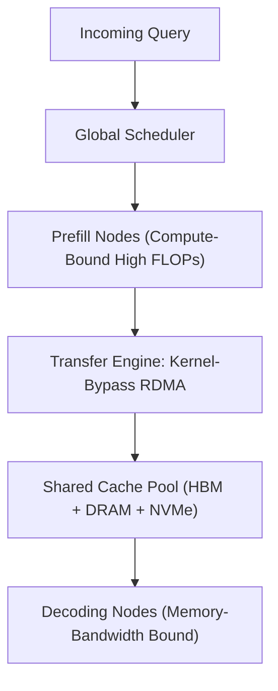

# Mooncake Disaggregated KV Cache Architecture

Mooncake (Moonshot AI / Kimi, 2024) is a KVCache-centric serving architecture that physically decouples compute-bound prefill from memory-bandwidth-bound decoding.

## Core Mechanics
1. **Prefill-Decoding Disaggregation:** Physical separation eliminates scheduling interference between compute-heavy chunked prefill passes and memory-bandwidth-heavy token generation.
2. **Cluster-Wide Multi-Tiered Cache Pool:** Aggregates unused GPU HBM, host system DRAM, and local NVMe SSDs into a unified, shared distributed cache hierarchy.
3. **Kernel-Bypass Zero-Copy RDMA:** The custom Transfer Engine streams KV cache tensors directly across nodes over RoCE or InfiniBand, enabling sub-millisecond Time-to-First-Token and sustaining 200K+ token long-context throughput at scale.

Related: [[duoattention_retrieval_streaming_heads]], [[pyramidkv_hierarchical_attention_funnel]], [[kivi_2bit_asymmetric_kv_quantization]], [[radixattention_tree_prefix_caching]]
