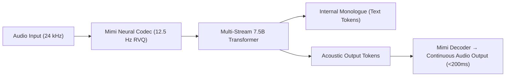

# Moshi & Mimi: Speech-Native Full-Duplex Architecture

**Moshi** is an open-weights, speech-native multimodal language model that processes real-time spoken dialogue with sub-200ms latency, eliminating the cascading overhead and emotional flattening of traditional ASR $\to$ LLM $\to$ TTS pipelines.

## Architectural Mechanics
1. **Mimi Neural Audio Codec:** Uses Residual Vector Quantization (RVQ) across 8 codebooks to compress 24kHz audio into 12.5 Hz frame representations (80ms frame window, 1.1 kbps bandwidth).
2. **Multi-Stream Interleaved Modeling:** The 7.5B parameter backbone models text tokens, user incoming audio tokens, and agent outgoing acoustic tokens concurrently in a unified sequence:
   $$P\left(U_t, M_t, T_t \mid U_{<t}, M_{<t}, T_{<t}\right)$$
3. **Full-Duplex Interruption Dynamics:** Supports organic overlapping speech, spontaneous laughter, emotional prosody, and instantaneous turn-taking with natural conversational cadence.

## Related Mechanics
- [[multimodal_prompting_topologies]]
- [[residual_vector_quantization_codecs]]
- [[streaming_inference_architectures]]
