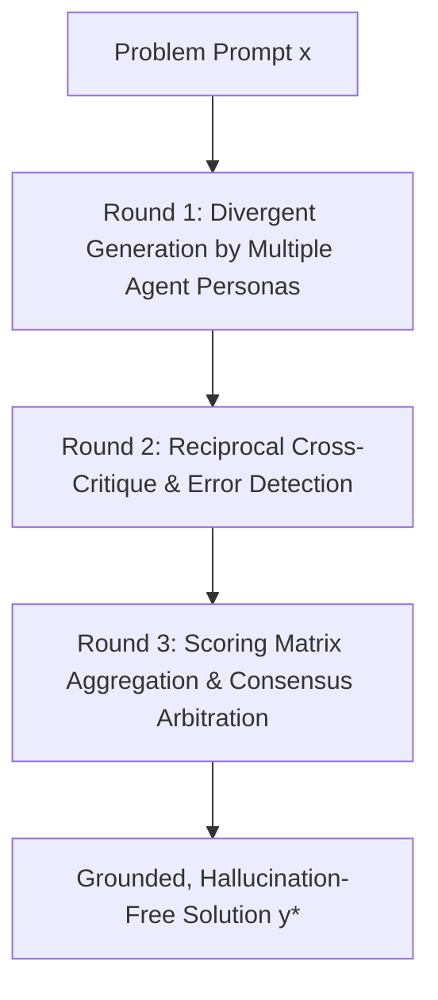

# Multi-Agent Debate: Consensus Convergence & Adversarial Deliberation

**Multi-Agent Debate (MAD)** structures reasoning across multiple autonomous LLM instances through iterative rounds of proposal, reciprocal critique, and consensus convergence to suppress hallucinations and eliminate cognitive bias.

## Algorithmic Topology
1. **Divergent Proposing:** Distinct agent personas propose independent reasoning paths, breaking single-model confirmation bias and intuitive trap states.
2. **Adversarial Critique Rounds:** Agents exchange arguments, identifying calculation errors, unsupported assumptions, and logical fallacies in peer trajectories.
3. **Consensus Convergence:** Convergence is tracked across debate rounds using peer-review scoring matrices:
   $$\text{Agreement}(t) = \frac{1}{N(N-1)} \sum_{i \neq j} \text{Sim}\left(y_i^{(t)}, y_j^{(t)}\right) \ge \tau_{\text{consensus}}$$
Multi-Agent Debate achieves a 4–8% accuracy uplift on GSM8K and MATH, providing robust multi-perspective error correction on complex reasoning tasks.

## Related Mechanics
- [[agent_orchestration_magentic_one_and_state_machines]]
- [[mixture_of_agents_collaborative_architectures]]
- [[self_consistency_sampling]]
